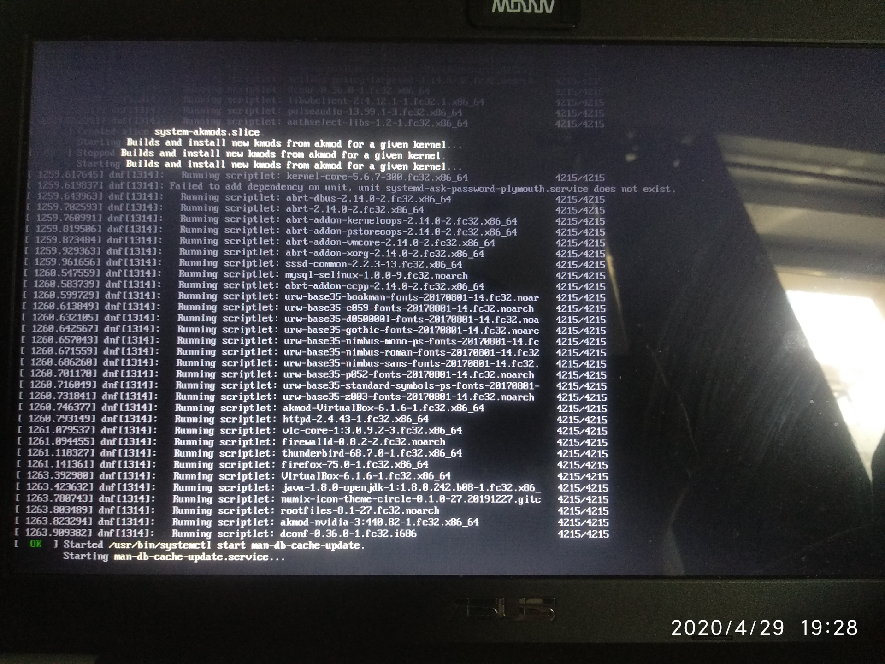
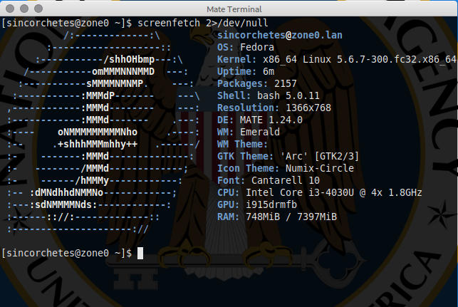

# Actualiza de Fedora 31 a Fedora 32

Si tienes Fedora 31 y estás tan desesperado por tener la nueva versión como yo, entonces te voy a guiar en esta senda oscura y pantanosa sobre cómo hacerlo.

# Primeros pasos
Antes de ponernos hacer nada, actualizamos todo el sistema:
```
$ sudo dnf clean all
$ sudo dnf upgrade --refresh
```

Con estos procesos eliminamos paquetes viejos, informaciones que hayan en cache de los repositorios viejos...etc y actualizamos el software pendiente.

Reiniciamos el sistema por si tenemos algún kernel nuevo instalado:
```
$ sudo systemctl reboot
```
Instalamos este paquete:
```
$ sudo dnf install dnf-plugin-system-upgrade
```
Descargamos todos los nuevos paquetes de F32:
```
$ sudo dnf system-upgrade download --refresh --releasever=32 --allowerasing
```
Como Fedora 32 ha eliminado su soporte con Python 2.7, si no añades el parámetro `--allowerasing` y tienes GIMP instalado por ejemplo, te dará un error como este:

```
Problem: conflicting requests
  - nothing provides module(platform:f31) needed by module gimp:2.10:3120191106095052:f636be4b-0.x86_64
Error: 
 Problem: package python2-beautifulsoup4-4.9.0-1.fc31.noarch requires python2-lxml, but none of the providers can be installed
  - python2-lxml-4.4.0-1.fc31.x86_64 does not belong to a distupgrade repository
  - problem with installed package python2-beautifulsoup4-4.9.0-1.fc31.noarch
(try to add '--skip-broken' to skip uninstallable packages)
```
__NOTA__: _¿Por qué no usar `--skip-broken`? Porque se supone que Fedora 32 tiene todas las dependencias arregladas para que no se use Python 2.7, mantener instalado un paquete que ya no está mantenido es un problema de seguridad._

Una vez que lo ejecutemos nos aparecerá un mensaje como este:
```
Before you continue ensure that your system is fully upgraded by running "dnf --refresh upgrade". Do you want to continue [y/N]: 
```
Escribimos <kbd>y</kbd> y pulsamos <kbd>Enter</kbd>.

Se empezarán a refrescar los repositorios, nos avisará de que el módulo de GIMP u otro software que tenga Python 2.7 se eliminará y nos pide confirmación.
```
Total download size: 2.4 G
DNF will only download packages, install gpg keys, and check the transaction.
Is this ok [y/N]: 
```
Escribimos <kbd>y</kbd> y pulsamos <kbd>Enter</kbd>.

Este es un video ejemplo: 
<a href="https://asciinema.org/a/325285" target="blank"></a>

Cuando hayamos terminado ejecutamos:
__NOTA:__ El siguiente proceso va a demorarse bastante tiempo, tómate un café, una cerveza o haz palomitas. Si vas a actualizar un portátil, no te olvides de conectarlo a la corriente.
```
sudo dnf system-upgrade reboot
```
Adjunto algunas capturas de como va el proceso de instalación después de reiniciar el sistema. Yo al no utilizar `plymouth` ni decoros, es posible que veas más "bonita" la actualización.

Después de arrancar, comenzará a instalar actualizaciones:


Una vez que termine, te comunicará que reiniciará el sistema:


Este es el getor de arranque con el nuevo kernel instalado:


Y voilá ya tendremos SO:



Si experimentas algún problema, puedes revisar la sección de errores frecuentes de la documentación <a href="https://fedoraproject.org/wiki/Common_F31_bugs" target="">aquí.</a>