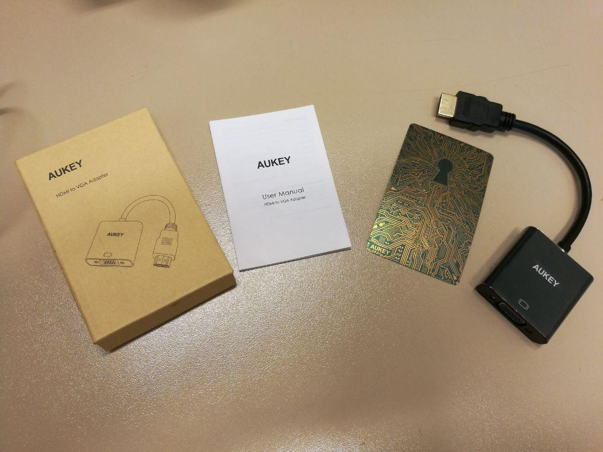

# Conversor HDMI-VGA Aukey

# Introducción

Hemos adquirido a través de [Amazon](https://goo.gl/vr23iy?target=_blank), un conversor HDMI-VGA debido a que tenemos un portátil que no tiene toma VGA, solo un puerto HDMI y 2 micro-HDMI. Queriamos tan solo compartir lo bien que nos funciona este dispositivo y por lo que recomendamos su compra. 100% compatible con Linux. El conversor viene dentro de una caja de cartón fino, con un pequelo manual, una pegatina y el conversor con el puerto HDMI cubierto por un protector de plástico duro para evitar que se deteriore.



Resultado de `xrandr(1)`:

```
$ xrandr
Screen 0: minimum 8 x 8, current 3200 x 1080, maximum 32767 x 32767
DP-0 disconnected (normal left inverted right x axis y axis)
DP-1 disconnected (normal left inverted right x axis y axis)
eDP-1-1 connected primary 1920x1080+1280+0 (normal left inverted right x axis y axis) 344mm x 194mm
   1920x1080     60.02*+
   1400x1050     59.98  
   1280x1024     60.02  
   1280x960      60.00  
   1024x768      60.04    60.00  
   960x720       60.00  
   928x696       60.05  
   896x672       60.01  
   800x600       60.00    60.32    56.25  
   700x525       59.98  
   640x512       60.02  
   640x480       60.00    59.94  
   512x384       60.00  
   400x300       60.32    56.34  
   320x240       60.05  
DP-1-1 disconnected (normal left inverted right x axis y axis)
HDMI-1-1 connected 1280x1024+0+0 (normal left inverted right x axis y axis) 338mm x 270mm
   1280x1024     60.02*+  75.02  
   1920x1080     60.00    59.94  
   1280x960      60.00  
   1152x864      75.00  
   1280x720      60.00    59.94  
   1024x768      75.03    70.07    60.00  
   832x624       74.55  
   800x600       72.19    75.00    60.32    56.25  
   640x480       75.00    72.81    66.67    60.00    59.94  
   720x400       70.08  
```