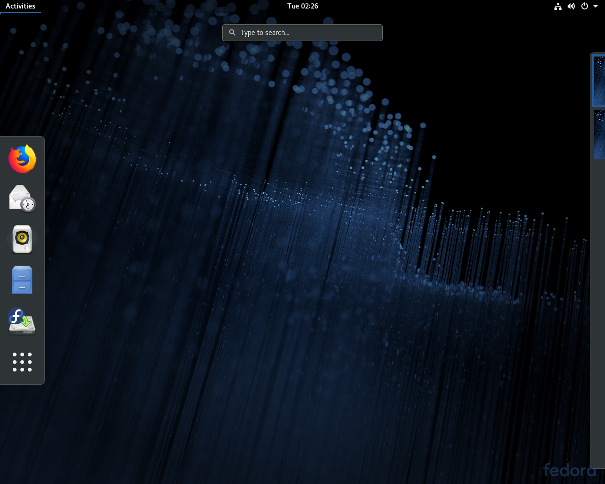
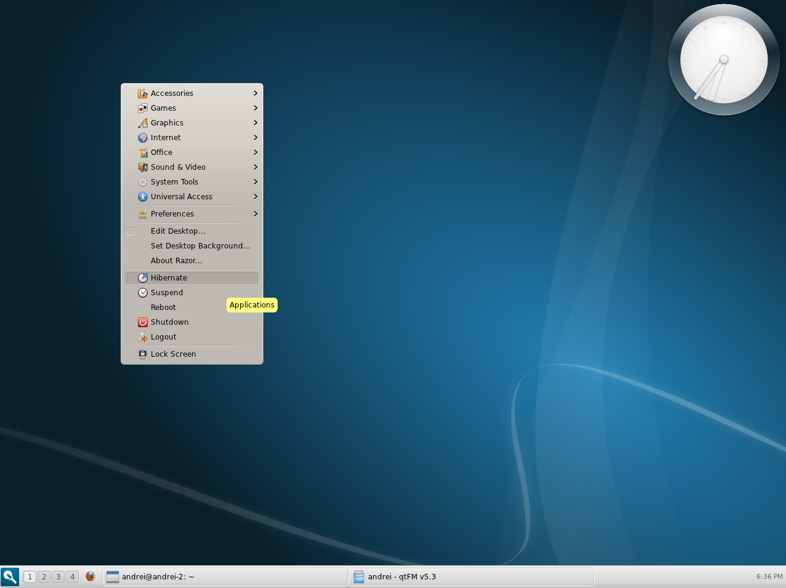

# Entornos de escritorio y gestores de ventanas

# Pasión gráfica

Hoy en día es indispensable hacer uso de un servidor gráfico que nos permita visualizar páginas Web, escuchar música y ver películas o series entre otras cosas. Eso de estar con terminales y reproducción de contenido multimedia en formato ASCII como que no nos va mucho. Queremos visualizar el contenido cuánto más nítido y con calidad, se vive mejor.

Sin embargo, hasta hace relativamente poco, solo disponíamos de terminales de texto y programas elaborados en una interfaz MS-DOS como suelen comentar las personas más veteranas (*ya que por mi edad, no pude vivirlo ni sentirlo*). La historia fue que hasta que Xerox PARC (*el centro de investigación del futuro para Xerox Corp.*), no sacó su primer Xerox Alto en 1973, no se utilizaba ningún tipo de interfaz gráfica y mucho menos, existía el concepto del cursor del ratón. Posteriormente, hubo una guerra entre Apple y Microsoft que se disputaron a ver quién copiaba mejor la interfaz gráfica y el ratón inventado de Xerox.

# Entornos de escritorio
Se denominan entornos de escritorio a un conjunto de software que contiene
interfaz gráfica y que permita realizar múltiples tareas de una forma sencilla,
fácil y productiva debido a su interacción amigable de cara al usuario.

Por ejemplo, ver los eventos de nuestro calendario sin tener que hacer uso de
comandos o terminales de texto; visualizar el correo electrónico solo haciendo
dos clics en el programa...

Haremos un breve repaso de los entornos de escritorio que existen en Linux y en
BSD que podemos instalar, y en qué se diferencian principalmente.

## CDE

*Common Desktop Environment*, fue un entorno gráfico para UNIX que fue
desarrollado por empresas de gran hincampié tecnológico como HP, IBM, Novell
y Sun (*comprada por Oracle*) viendo su primera versión en junio de 1993 de la
mano de HP, IBM, SunSoft y USL(*Unix System Laboratories*). Estos elaboraron un
proyecto en común repartiéndose las tareas para llevar a cabo diferentes
objetivos hasta llegar a su primera versión del escritorio. Posteriormente, se
fueron involucrando más empresas en su desarrollo. No obstante, estuvo unos años en el mercado
hasta que GNOME y KDE les arrebató su posicionamiento. 

## GNOME

GNOME (*GNU Network Object Model Environment*) traducido al español como Entorno
de Modelo de Objeto de Red GNU, un nombre no tan amigable como sus siglas fue
desarrollado por Miguel de Icaza y Federico Mena el 15 de agosto de 1997 como alternativa a KDE (*ahora Plasma*) para sistemas operativos UNIX-like tipo BSD, Linux, o UNIX como esSolaris (*antes SunOS*).

Una de las características de GNOME es que hace uso de GTK+. Es un conjunto de
bibliotecas multiplataforma para desarrollar interfaces gráficas para el
usuario. Básicamente, define entre otras cosas el diseño de la ventana, los
botones, introduce eventos, disparadores... como Qt en Plasma o Motif en CDE pero cada cual tiene sus
diferencias.

Por otro lado, pretende ser un entorno de escritorio de fácil uso con poca
personalización (*sobre todo en la última versión 3.x*) con el que se pueda
trabajar desde el minuto 0.

### Instalación
Desde los repositorios oficiales de cada distribución o sistema, hay
distribuciones que requieren de pasos adicionales e incluso, configuraciones que
no permitan la instalación de GNOME con el gestor de servicios systemd como es
el caso de Gentoo, o también contemplan la
instalación más básica de GNOME que sucede tanto en Gentoo como en Archlinux. Por ende,
os recomendamos la documentación.:
* Fedora: `sudo dnf install @gnome-desktop`
* CentOS: `sudo yum install @gnome-desktop`
* [Archlinux](https://wiki.archlinux.org/index.php/GNOME?target=_blank): `sudo pacman -S gnome gnome-extra`
* [Gentoo](https://wiki.gentoo.org/wiki/GNOME?target=_blank) (systemd): `USE="-qt4 -qt5 -kde X gtk gnome systemd" sudo emerge --ask gnome-base/gnome"`
* Ubuntu: `sudo apt-get install ubuntu-gnome-desktop`
* Debian: Se utiliza una herramienta llamada `taskel(8)` con interfaz ncurses que permite la instalación de un entorno. `sudo apt-get install tasksel && sudo tasksel`
* openSUSE Leap 42.3: `sudo zypper -n in patterns-openSUSE-gnome`
* [FreeBSD](https://www.freebsd.org/doc/handbook/x11-wm.html?target=_blank): `sudo pkg install gnome3`

## KDE (aka Plasma)

KDE fue el primer entorno de escritorio para sistemas UNIX-like que nació en
octubre de 1996 de la mano de un programador alemán llamado Matthias Ettrich que
buscaba básicamente una interfaz gráfica que unificáse todos los sistemas UNIX
imitando el entorno de escritorio CDE.

Plasma se caracteriza a parte de hacer uso de la suite Qt de bibliotecas
gráficas, de hacer un entorno muy completo y muy personalizado, en el se puede
configurar todo lo que un usuario jamás pudo haber imaginado que podía llegar a
configurar en un entorno, y sobre todo, haciendo uso de sus propias herramientas
para hacerlo sin utilizar software a terceros tipo GNOME TweakTool, o teniendo
conocimientos de JavaScript o CSS para modificar estilos y comportamientos como
hacen las últimas versiones de GNOME.

Hoy en día, el software de Plasma es tan portable, que se puede hasta ejecutar
en Windows y en dispositivos móviles.

### Instalación
Desde los repositorios oficiales de cada distribución o sistema, hay
distribuciones que requieren de pasos adicionales e incluso, configuraciones que
no permitan la instalación de GNOME con el gestor de servicios systemd como es
el caso de Gentoo, o también contemplan la
instalación más básica de Plasma (KDE) que sucede tanto en Gentoo como en Archlinux. Por ende,
os recomendamos la documentación:
* Fedora: `sudo dnf install @kde-desktop`
* CentOS: `sudo yum install @kde-desktop`
* [Archlinux](https://wiki.archlinux.org/index.php/KDE?target=_blank): `sudo pacman -S plasma`
* [Gentoo](https://wiki.gentoo.org/wiki/KDE?target=_blank) (systemd): `sudo emerge --ask kde-plasma/plasma-meta"`
* Ubuntu: `sudo apt-get install kde-plasma-desktop`
* Debian: Se utiliza una herramienta llamada `taskel(8)` con interfaz ncurses que permite la instalación de un entorno. `sudo apt-get install tasksel && sudo tasksel`
* openSUSE Leap 42.3: `sudo zypper -n in patterns-openSUSE-kde`
* [FreeBSD](https://www.freebsd.org/doc/handbook/x11-wm.html?target=_blank): `sudo pkg install gnome3`

## MATE

MATE es un fork de GNOME que salió el 19 de agosto de 2011 como muestra del descontento de la nueva versión de GNOME 3 debido a que reducía muchísimo la personalización del entorno de escritorio, consumía mucho más, y tenía otro tipo de funcionalidades y características no muy transigentes. Este proyecto fue desarrollado por un desarrollador argenito de Archlinux llamado Germán Perugorría conocido en la comunidad del software libre como Perberos para continuar el desarrollo de este entorno de escritorio. Que por cierto, es el que nosotros utilizamos. El nombre proviene de la hierba Mate muy común en Argentina para tomar.

Este entorno liberó su última versión el 7 de febrero de 2018, con la satisfacción de haberse portado plenamente a la nueva suite de bibliotecas de GTK+ 3 y añadiendo más funcionalidades que no tenía sobre todo en Caja que en GNOME 3 se llama Nautilus.

### Instalación
* Fedora: `sudo dnf install @mate-desktop`
* CentOS: `sudo yum install epel-release && sudo yum install @mate-desktop`
* [Archlinux](https://wiki.archlinux.org/index.php/MATE?target=_blank): `sudo pacman -S mate-desktop`
* [Gentoo](https://wiki.gentoo.org/wiki/MATE?target=_blank) (systemd): `sudo emerge --ask mate-base/mate"`
* Ubuntu: `sudo apt-get install mate-desktop`
* Debian: Se utiliza una herramienta llamada `taskel(8)` con interfaz ncurses que permite la instalación de un entorno. `sudo apt-get install tasksel && sudo tasksel`
* openSUSE Leap 42.3: `sudo zypper -n in patterns-openSUSE-kde`
* [FreeBSD](https://www.freebsd.org/doc/handbook/x11-wm.html?target=_blank): `sudo pkg install gnome3`

## XFCE

XFCE se caracteriza por ser un entorno de escritorio muy liviano y ligero ya que
ese eran sus dos objetivos cuando se desarrolló. La primera versión se liberó en
1996 de la mano de Olivier Fourdan. Este utiliza las bibliotecas de GTK+ para el
desarrollo de sus programas gráficos.

Actualmente está comenzando a portar su software a GTK+ 3 llegando un poco
tarde, ya que actualmente ya se está desarrollando GTK+ 4.

### Instalación
Desde los repositorios oficiales de cada distribución o sistema, hay
distribuciones que requieren de pasos adicionales e incluso, configuraciones que
no permitan la instalación de XFCE con el gestor de servicios systemd como es
el caso de Gentoo, o también contemplan la
instalación más básica de XFCE que sucede tanto en Gentoo como en Archlinux. Por ende,
os recomendamos la documentación:
* Fedora: `sudo dnf install @xfce-desktop`
* CentOS (*require tener activado epel*): `sudo yum install epel-release && sudo yum install @xfce-desktop`
* [Archlinux](https://wiki.archlinux.org/index.php/XFCE?target=_blank): `sudo pacman -S plasma`
* [Gentoo](https://wiki.gentoo.org/wiki/Xfce?target=_blank) (systemd): `sudo emerge --ask "`
* Ubuntu: `sudo apt-get install xfce-desktop`
* Debian: Se utiliza una herramienta llamada `taskel(8)` con interfaz ncurses que permite la instalación de un entorno. `sudo apt-get install tasksel && sudo tasksel`
* openSUSE: Hay que habilitarlo desde Factory
* [FreeBSD](https://www.freebsd.org/doc/handbook/x11-wm.html?target=_blank): `sudo pkg install xfce`

## LXDE

Este fue un entorno de escritorio también como el anterior, cuyo objetivo era
proveer a un PC de una suite de herramientas gráficas que permitieran trabajar
consumiendo lo más mínimo de un ordenador. Su primera versión fue liberada en
2006 por Hong Jen Yee. Actualmente tiene su desarrollo parado, ya que se
sustituyó por LXQt.

## LXQt

Es la continuación del proyecto LXDE como entorno de escritorio. El anterior
hacia uso de librerías GTK+, LXQT hace uso de Qt ya que al parecer al creador de
LXDE no le terminó de convencer GTK+. Su objetivo y finalidad son el mismo que
en LXDE.

### Instalación
Desde los repositorios oficiales de cada distribución o sistema, hay
distribuciones que requieren de pasos adicionales e incluso, configuraciones que
no permitan la instalación de LXQt con el gestor de servicios systemd como es
el caso de Gentoo, o también contemplan la
instalación más básica de LXQt que sucede tanto en Gentoo como en Archlinux. Por ende,
os recomendamos la documentación:
* Fedora: `sudo dnf install @lxqt-desktop`
* CentOS (*require tener activado epel*): `sudo yum install epel-release && sudo yum install lxqt-*`
* [Archlinux](https://wiki.archlinux.org/index.php/LXQt?target=_blank): `sudo pacman -S lxqt`
* [Gentoo](https://wiki.gentoo.org/wiki/LXQt?target=_blank) (*Requiere pasos adicionales*): `sudo emerge --ask lxqt-meta`
* Ubuntu: No disponible
* Debian: Se utiliza una herramienta llamada `taskel(8)` con interfaz ncurses que permite la instalación de un entorno. `sudo apt-get install tasksel && sudo tasksel`
* openSUSE Leap 42.3: `sudo zypper in -y pattern lxqt`
* [FreeBSD](https://wiki.freebsd.org/LXQt?target=_blank) (Requiere pasos adicionales): `sudo pkg install lxqt`

## Razor-Qt

Fue un entorno de escritorio desarrollado con las bibiliotecas Qt en 2010, no
obstante, el equipo de Razor-Qt empezó a colaborar con el creador de LXDE
originando el entorno anteriori dando origen a la primera versión en julio del
2014.

## Sugar Desktop

Sugar es un entorno de escritorio que nació con el objetivo de crear una
interfaz muy intuitiva para aquell@s niñ@s que no podían acceder a la tecnología
puntera de países del primer mundo. Creada por Sugar Labs en mayo del 2016,
como entorno para el proyecto OLPC (*One Laptop Per Child*) un proyecto en el que se
le permite a los niños mediante un portátil de bajo costo enseñarles a
incorporarse a la tecnología sin necesidad de tener grandes recursos pudo crecer
y seguir manteníendose como una alternativa educativa también para l@s más
peques de la casa.

### Instalación
Desde los repositorios oficiales de cada distribución o sistema, hay
distribuciones que requieren de pasos adicionales e incluso, configuraciones que
no permitan la instalación de Sugar con el gestor de servicios systemd como es
el caso de Gentoo, o también contemplan la
instalación más básica de Sugar que sucede tanto en Gentoo como en Archlinux. Por ende,
os recomendamos la documentación:
* Fedora: `sudo dnf install @sugar-desktop`
* CentOS: No disponible, al menos de manera oficial. 
* [Archlinux](https://wiki.archlinux.org/index.php/Sugar?target=_blank): `sudo pacman -S sugar`
* Gentoo: No disponible de manera oficial.
* Ubuntu: `sudo apt-get install sucrose` 
* Debian: `sudo apt-get install sucrose` 
* openSUSE Leap 42.3: `zypper ar http://download.opensuse.org/repositories/X11:/Sugar/openSUSE_13.1/ X11:Sugar &&  zypper refresh && zypper in sugar sugar-activities`
* FreeBSD: No disponible de forma oficial ni extra oficial.

# Gestores de ventanas
Los gestores de ventanas es un conjunto mínimo de software que nos permite
establecer una sesión gráfica con la que poder interactuar con elementos
gráficos. Su consumo es muy pequeño al igual que sus prestaciones, pero, se
puede llegar a ser muy productivo con ellos si se saben configurar y utilizar.

## TWM

Tab Window Manager, es el gestor de ventanas más común en todo Linux. Fue desarrollado por Tom LaStrange desde 1987, el nombre original estaba basado en la siglas de su nombre Tom's Window Manager, pero el X Consortium lo adoptó y lo renombró en 1989. En TWM se pueden apilar las ventanas, las cuáles contienen título, e iconos para interactuar. Este gestor de ventana suele utilizarse con programas como un reloj analógico `xclock(1)`, y también un emulador de terminal llamado `xterm(1)` entre otros.

### Instalación

* Fedora: `sudo dnf install xorg-x11-twm`
* CentOS: No disponible, al menos de manera oficial. 
* [Archlinux](https://wiki.archlinux.org/index.php/twm?target=_blank): `sudo pacman -S xorg-twm`
* Gentoo: No disponible de manera oficial.
* Ubuntu: `sudo apt-get install twm` 
* Debian: `sudo apt-get install twm`  
* openSUSE Leap 42.3:`sudo zypper in twm`
* FreeBSD: `pkg install twm`

## i3wm

i3wm o también conocido como i3, es un gestor de ventanas que no se superposiciona, simplemente se adapta una ventana con la otra sin superponerse. i3 nos permite gestionar ventanas en modo *stack* es decir, apiladas, o bien en modo de pestañas *tab* entre más características. En suma, soporta modo multi-pantalla, está reescrita desde 0 estando todo su código licenciado bajo términos BSD. Hay que destacar que tiene soporte UTF-8 y es muy fácil de configurar. Su primera versión fue escrita en C por Michael Stapelberg el 15 de marzo del 2009.

### Instalación

* Fedora: `sudo dnf install i3`
* CentOS: `sudo yum install epel-release && sudo yum install i3` 
* [Archlinux](https://wiki.archlinux.org/index.php/i3?target=_blank): `sudo pacman -S i3-wm`
* [Gentoo](https://wiki.gentoo.org/wiki/I3?target=_blank): `sudo emerge --ask x11-wm/i3`
* Ubuntu: `sudo apt-get install i3` 
* Debian: `sudo apt-get install i3`  
* openSUSE Leap 42.3:`sudo zypper in twm`
* FreeBSD: `sudo pkg install x11-wm/i3`

## Fluxbox

Fluxbox es un gestor de ventanas creado por Henrik Kinnunen el 12 de septiembre de 2001. Es un wm muy sencillo y fácil de usar, bastante ligero en cuanto consumo y rendimiento. Está basado en un gestor de ventanas llamado Blackbox ya desmantenido. La última versión liberada es la 1.3.7 publicada el 8 de febrero de 2015.

### Instalación

* Fedora: `sudo dnf install fluxbox`
* CentOS: `sudo yum install epel-release && sudo yum install fluxbox` 
* [Archlinux](https://wiki.archlinux.org/index.php/fluxbox?target=_blank): `sudo pacman -S fluxbox`
* [Gentoo](https://wiki.gentoo.org/wiki/Fluxbox?target=_blank): `sudo emerge --ask x11-wm/fluxbox`
* Ubuntu: `sudo apt-get install fluxbox` 
* Debian: `sudo apt-get install fluxbox`  
* openSUSE Leap 42.3:`sudo zypper in fluxbox`
* FreeBSD: `sudo pkg install x11-wm/fluxbox`

## Openbox

Openbox es otro gestor de ventanas creado por Dana Jansens y Mikael Magnusson el 18 de septiembre de 2002. Este también derivó de sus inicios de Blackbox, sin embargo, ha sido reescrito totalmente desde la versión 3.0. Este gestor sacrifica entre otras cosas algunas funciones típicas como la barra de menú, lista de apps en ejecución o bordes redondeados en las ventanas. No obstante, posee herramientas de configuración del entorno bastane útiles para cambiar el fondo de pantalla, tema del gestor...etc, no obstante, el gestor de ventanas lleva sin desarrollarse desde el 1 de julio del 2015.

### Instalación

* Fedora: `sudo dnf install openbox`
* CentOS: `sudo yum install epel-release && sudo yum install openbox` 
* [Archlinux](https://wiki.archlinux.org/index.php/openbox?target=_blank): `sudo pacman -S openbox`
* [Gentoo](https://wiki.gentoo.org/wiki/Openbox?target=_blank): `sudo emerge --ask x11-wm/fluxbox`
* Ubuntu: `sudo apt-get install openbox` 
* Debian: `sudo apt-get install openbox`  
* openSUSE Leap 42.3:`sudo zypper in openbox`
* FreeBSD: `sudo pkg install x11-wm/openbox`

## Enlightenment

Es un gestor de ventanas con una gran cantidad de *applets*, módulos y aplicaciones que lo intentan convertir en un entorno de escritorio completo, la primera versión liberada fue en 1997 por Rasterman (Carsten Haitzler), mientras que la última versión liberada fue el 15 de marzo de 2018. Enlightenment lleva un desarrollo lento y denso que hace que el entorno sea un poco menos novedoso y no todos sus módulos y *applets* están bien recibidos según que distribuciones. Suelen faltar muchos de ellos, y algunas veces las compilaciones de los mismos no suelen llevar a resultados favorables. No obstante es una buena alternativa para aquellas personas que busquen un estado intermedio entre gestor y entorno, y resulta muy liviano y con una imagen un tanto *futurista*.

### Instalación
* Fedora: `sudo dnf install enlightenment`
* CentOS: No disponible de forma oficial.
* [Archlinux](https://wiki.archlinux.org/index.php/Enlightenment?target=_blank): `sudo pacman -S enlightenment`
* [Gentoo](https://wiki.gentoo.org/wiki/Enlightenment?target=_blank): `sudo emerge --ask enlightenment:0`
* Ubuntu: `sudo apt-get install e17` 
* Debian: `sudo apt-get install e17`  
* openSUSE Leap 42.3:`sudo zypper in enlightenment`
* FreeBSD: `sudo pkg install x11-wm/enlightenment`

## Awesome

Otro gestor de ventanas elaborado en C y en Lua, también es parecido a i3 en el que no es necesario hacer uso de ningún tipo de ratón y permite acoplar fácilmente las ventanas entre sí. La primera versión fue liberada el 18 de septiembre del 2007 por Julien Danjou, siendo un fork de dwm. En algunas distribuciones se encuentra disponible, pero desde el 25 de septiembre del 2016 se encuentra desmantenido.

## wmii

Windows Manager Improved 2, es un gestor de ventanas que soporta el manejo de ventanas con ratón o teclado elaborado por Anselm R. Garbe y Kris Maglione y viendo la luz por primera vez el 1 de junio de 2005, tiene una filosofía minimalista de no ir más allá de 10,000 líneas de código. La última versión estable fue liberada el 1 de julio del 2017.

## dwm

Es otro gestor de ventanas desarrollado por Anselm R. Garbe y liberándolo el 14 de julio de 2006. Es un wm muy minimalista pareciéndose a wmii, sin embargo, es mucho más simple que este último y está escrito en puro C para tener un rendimiento mucho más elevado además de añadir seguridad al código, pero este muy conocido gestor de ventanas se quedó en desarrollo al igual que wmii, el 1 de julio de 2017.

# Fuentes
* [Wikipedia.org](https://www.wikipedia.org?target=_blank) ~ Información de gestores de ventana e imágenes de entorno de escritorios
* [suckless.org](https://suckless.org?target=_blank) ~ Info y capturas de pantalla tanto de dwm como wmii
* [Softpedia.com](http://www.softpedia.com?target=_blank) ~ Cortesía imágenes de entornos de escritorio
* [FedoraProject.org](https://fedoraproject.org?target=_blank) ~ Gracias a su apartado de spins que contienen imágenes del entorno Sugar y XFCE (entre otros)
* [Proyecto GNOME](https://www.gnome.org?target=_blank) ~ Imágenes e información adicional
* [KDE Project](https://www.kde.org?target=_blank) ~ Imágenes e información adicional
* [LXDE](https://lxde.org?target=_blank) y [LXQt](https://lxqt.org?target=_blank) ~ Capturas de pantalla e información adicional
* [Razor-Qt git](https://github.com/Razor-qt/razor-qt?target=_blank)
* [Ubuntu packages](https://packages.ubuntu.com?target=_blank)
* [Debian packages](https://packages.debian.org?target=_blank)
* [Archlinux packages](https://www.archlinux.org/packages?target=_blank)
* [Fedora packages](https://apps.fedoraproject.org/packages?target=_blank)
* [Gentoo packages](https://packages.gentoo.org?target=_blank)
* [FreeBSD Ports](https://www.freebsd.org/ports?target=_blank)