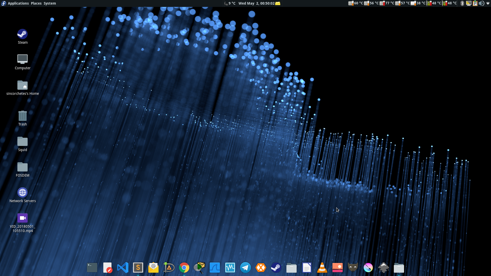

# Fedora 28 liberada

# Un sabor agridulce

Fedora como tal, vio la luz por primera vez el 6 de noviembre de 2003 por parte del Proyecto Fedora, ya que, al principio solo era un repositorio de software adicional retestado para el viejo sistema operativo de la multinacional líder en opensource y software libre Red Hat. Este repositorio fue creado por Warren Togami en el 2002 en la universidad de Hawaii como un proyecto universitario. Sin embargo, se hizo tan popular que lleguó a convertirse en un sistema operativo comunitario llamado Fedora Core y que, en 2007 pasó a llamarse Fedora.

Este utilizaba como logo un sombrero azul, ya que, la empresa Red Hat utiliza un sombrero de color rojo para su representación.

# Características de Fedora

El Proyecto Fedora es una comunidad muy amplia que se encuentra alrededor de todo el mundo como muchas de las demás comunidades en el software libre. Esta difunde una serie de valores como colaborar activamente con los proyectos de software como por ejemplo GIMP, GNOME, Plasma (antes KDE) reportando errores via upstream facilitando sus correciones y adheriendo el código nuevo en los proyectos. De tal forma, que toda persona que utilice estos software que hemos mencionado acabe utilizando código de Fedora. También premia la introducción de las nuevas tecnologías tanto a nivel de desarrollo como el software GCC, Binutils, Go, Python... hasta pasar por Devops y administradores de sistemas incluyendo soporte para arquitecturas en auge como ARM64 (AArch64) para server, imágenes para s390x...etc. La tercera es tener una comunidad fuerte y amistosa en la que apoyarse, un buen compañerismo es clave no solo para el PF, si no para cualquier tipo de proyecto comunitario. Y por último, premian mucho la libertad y difunden software libre y de open source frente al software privativo ya que si se utiliza el privativo y no se da pie al conocimiento de las demás alternativas libres obligan al usuario al final a depender de software registrado en licencias restrictivas.

También es una de las comunidades que no suelen perderse eventos alrededor de todo el mundo sobre software libre como FOSDEM en Bélgica, LinuxCon en Barcelona (2012), DevCon... etc. Incluso, organizan macroeventos llamados Flock  (antes FUDCon) dónde todos los colaboradores pueden tener un punto de encuentro y conocerse cara a cara.

# Novedades

Fedora 28 contiene multitud de novedades que no nos podemos perder, ¡es un disparate! abarca todos los perfiles, usuarios finales, desarrolladores, DevOps, administradores de sistemas...

## Arquitectura AArch64 para servidores

En esta nueva versión se facilitan imágenes de Fedora Server para esta arquitectura como DVDs para instalar, imágenes cloud en formato qcow2 (_muy utilizado por el software emulador, Qemu_) e imágenes Docker para gestionar contenedores.

[Más info](https://fedoraproject.org/wiki/Changes/AArch64_Server_Promotion?target=_blank)

## Modularización de Anaconda

Anaconda es el instalador por excelencia de Fedora, hace unos pocos años que se reescribió completamente dando un aire de frescura haciéndolo más fácil e intuitivo que hace años atrás. Muchos de los módulos se dividirán en varias partes que se comunicarán con DBus mediante una API. El objetivo es proveer de un instalador que permita personalizarse, potenciarse añadiendo plugins, extensiones... y sobre todo más formas de probar que funciona.

[Más info](https://fedoraproject.org/wiki/Changes/AnacondaModularization?target=_blank)

## Binarios anotados

Añade información extra a los binarios que hayan sido compilados con GCC. Esta información se puede utilizar por los scripts para comprobar varias características de ficheros como las opciones de refuerzo de seguridad (_hardering_) o posibles conflictos con ABI

[Más info](https://fedoraproject.org/wiki/Changes/Annobin?target=_blank)

## Imágenes cloud y/o contenedores para s390x

Se facilitarán imágenes para esta arquitectura incluyendo las variantes de Fedora. Éstas estarán disponibles en formato qcow2 y raw.

[Más info](https://fedoraproject.org/wiki/Changes/Atomic_Cloud_and_Docker_images_for_s390x?target=_blank)

## Software modular 

Fedora proveerá de una serie de repositorios de software y actualizaciones con versiones alternativas a las suministradas por los repositorios oficiales.

[Más info](https://fedoraproject.org/wiki/Changes/F28AddonModularity?target=_blank)

## Ahorro de batería en portátiles

Se mejora la versión de Fedora Workstation para el consumo de la batería en ordenadores portátiles por defecto.

[Más info](https://fedoraproject.org/wiki/Changes/ImprovedLaptopBatteryLife?target=_blank)

## En cuánto a desarrollador

Tenemos una lista de software que se ha actualizado como:

* Binutils 2.29.1
* Boost 1.66
* GCC 8.0.1
* GHC 8.2.2
* GNU C Lib 2.27
* Ruby 2.5
* Golang 1.10.1
* Django 2.0.4
* Java-openjdk-10.0.46
* Erlang 20.3.2
* PHP 7.2.4

## Para usuarios finales
{.size-full}

No nos olvidemos que tenemos una lista de novedades para aquellas personas que utilicen entornos de escritorio, entre ellas:

* Sugar 0.112
* GNOME 3.28.1
* Plasma 5.12.4
* MATE 1.20.0
* Cinnamon 3.8.0
* Enlightenment 0.22.3
* XFCE 4.12.1
* LXQt 3.1.0

Y un sin fin de más novedades que puedes revisar en el [siguiente enlace](https://fedoraproject.org/wiki/Releases/28/ChangeSet?target=_blank)

¿A qué esperas para probarlo?

# Enlaces

Descarga Fedora de forma directa a través de los siguientes enlaces:

* [Workstation](https://getfedora.org/es/workstation/download?target=_blank) (con GNOME)
* [Server](https://getfedora.org/es/server/download?target=_blank) (Contiene Cockpit para gestión mínima del servidor)
* [Atomic](https://getfedora.org/es/workstation/download?target=_blank) (Imágenes cloud)

Accede a los enlaces de torrent desde [aquí](https://torrent.fedoraproject.org?target=_blank)

¡A disfrutar!

*Nota: La imagen de cabecera fue extraída del artículo "[Announcing Fedora 28](https://fedoramagazine.org/announcing-fedora-28?target=_blank) en FedoraMagazine.org"*