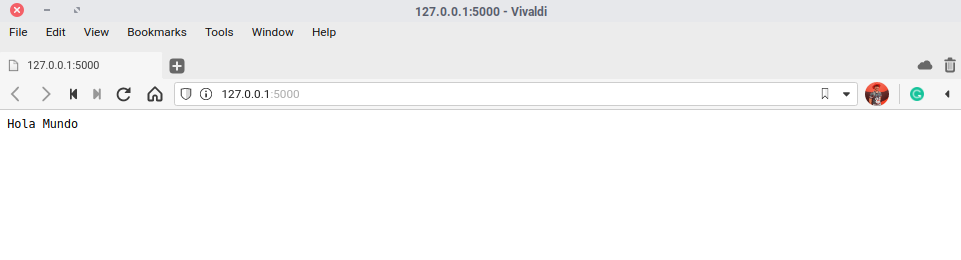

# Flask - Creando una mini aplicación

En este tutorial aprenderás a utilizar Flask. Flask es un web framework elaborado en Python que te permite crear aplicaciones web bastante sencillas, pero potentes ya que el potencial se lo das tu elaborando tu propio sistema de validación, tus propios métodos de conexión a bases de datos... etc porque no olvidemos que es un microframework y no tiene muchas cosas como quizás tendría un framework como Django que contiene muchas más herramientas y desarrrollo.

Este tutorial lo he hecho basándome en la documentación oficial, pero con toques personales, así evito reproducir contenido una y otra vez.

# ¿Qué necesito?
* Tener Python 3.5 o superior instalado y PyPy
* Aunque soporte 2.7, no es recomendable utilizar esta versión porque el 31 de diciembre del año pasado se dejó de mantener la rama 2.x
* Una o varias tazas de café

# ¿Cómo empezar?
A mi modo de ver las cosas y para no mezclar, siempre es mejor que utilices un entorno virtual que no el propio entorno del sistema, es decir, para instalar Flask hay que descargar una serie de códigos que se instalarán en tu sistema. Sin embargo, con un entorno virtual, puedes instalar, eliminar... o lo que quieras hacer sin dañar la instalación de Python del sistema base, ya sea Fedora, CentOS...etc

## Creando un entorno virtual
```
$ python3 -m venv proyecto_flask
```
Cuando se haya creado, entonces ejecutamos:
```
$ flask/bin/activate
```
Este script carga variables de entorno y rutas para que puedas trabajar con tu proyecto, si te fijas, en el prompt de la terminal ya no está mostrándose como `"$"`, si no, `"(proyecto_flask) $" `

### Instalando Flask
Para instalar Flask, con el entorno virtual activo:
```
(proyecto_flask) $ pip install flask
```
Esto es todo, ya lo tendremos instalado.

# Creando la mini aplicación
Utilizamos de ejemplo este directorio: `/home/sincorchetes/proyecto_flask`, si utilizas otro, que me imagino que sí, adáptalo al que utilices, y crea un subdirectorio llamado `app`.

Crea un archivo vacio y llámalo `core.py` (_puedes llamarlo como quieras si luego defines que cargue el nombre correcto_) y añades el siguiente contenido.

#### `app/core.py`
```
from flask import Flask
proyecto = Flask(_name_)

@proyecto.route('/')
def hola_mundo():
  return 'Hola Mundo'
```
* La primera línea, importará el módulo Flask.
* La segunda, inicializamos un objeto llamado proyecto que tiene una clase Flask y que hace referencia a sí mismo.
* En la tercera línea, `@proyecto.route('/')` estamos diciendo que cuando el visitante acceda a: http://pepitodelospalotes.es verá lo que se haya definido en la función de abajo.
* En las últimas líneas, desarrollamos la lógica de la aplicación, con la función `hola_mundo()`, le decimos que cuando el visitante acceda a la página verá lo que hay dentro del `return`, que en este caso es `Hola Mundo`.

Guarda el archivo, abre una terminal y sitúate en el directorio de la aplicación.
```
export FLASK_APP=/home/sincorchetes/proyecto_flask/app/core.py && \
export FLASK_DEBUG=1 && \
flask run 
```
La variables `FLASK_APP`, defines el `core` de la aplicación, `FLASK_DEBUG` permite activar el modo depuración que viene con ayuda para que nos muestre de dónde puede provenir los errores...etc y `flask run` levanta un servidor de desarrollo para que puedas ver los cambios sin tener que utilizar un servidor web como Nginx o Apache.

Una vez levantada la aplicación, si accedemos a http://localhost:5000 verás el Hola Mundo que has definido en el archivo `core.py`.



## ¿Cómo creo una página?
Como he dicho anteriormente, Flask permite crear aplicaciones web, esto no solo incluye la parte de backend que es dónde definimos la lógica de la aplicación, si no que también puedes crear la parte frontend, la parte de visible con la que el usuario interactuará.

Hay que crear el directorio`templates` para añadir las páginas .html

Una vez hecho esto, creas el archivo `app/templates/index.html` y le añades el siguiente contenido:
#### `index.html`
```
<!DOCTYPE html>
<html lang="es">
  <head>
    <title>Ejemplo de aplicación hecha en Flask</title>
  </head>
  <body>
    <div class="contenedor">
      <div class="titulo">
        <h1>¡Bienvenidos a mi página Web!</h1>
      </div>
      <div class="tareas">
        <p>¿Te gustan los perros y los coches? Esta es tú página ideal.</p>
      </div>
    </div>
  </body>
</html>
```
Actualiza el fichero `core.py` de tal modo que se quede así:
#### `app/core.py`
```
from flask import Flask, render_template
proyecto = Flask(_name_)

@proyecto.route('/')
def hola_mundo():
  return render_template('index.html')
```
He añadido `render_template` que permite renderizar contenido .html en el proceso de importar módulos y en la última línea llamamos al método cuyo valor es el archivo que has creado.

Verás una página como esta:


## ¿Cómo añado hojas de estilo o código JavaScript?
Hay crear un directorio llamado `static` tal que así:
```
(proyecto_flask) $ mkdir /home/sincorchetes/proyecto_flask/app/static
```
Dentro de él, añade todo el contenido CSS o JS que cargará la página, lo que suelo hacer, es crear un subdirectorio css y para las hojas de estilo y js para la lógica de eventos para el usuario.

Para llamarlo, bastará con importar el módulo `url_for` y luego referenciarlo en el index.html. 
`core.py`
```
from flask import Flask,render_template,url_for
```
#### `app/templates/index.html`
```
<head>
  <link rel="stylesheet" href="{{ url_for('static',filename='css/nombre_archivo.css) }}">
</head>
<body>
  <script src="url_for('static',filename='js/nombre_archivo.js) }}></script>
</body>
```
Con esto bastará, creamos un archivo en `app/static/css/ejemplo.css` y añade el siguiente código:
#### `app/static/css/ejemplo.css`
```
.body{
  font-family: Arial;
}
.contenedor {
  border-radius: 30px;
  padding:20px;
  background-color: #D3D7CF;
}
.titulo {
  text-align:center;
}
.tareas {
  background-color: white;
  border-radius: 30px;
  padding:10px;
}
.date {
	font-size: 0.4em;
	text-align: right;
	padding-left:40%;
}
```
Creamos un archivo llamado ejemplo.js que mostrará un cuadro de diálogo:
#### `app/static/js/ejemplo.js`
```
alert("Bienvenido usuario")
```
#### `index.html`
```
<!DOCTYPE html>
<html lang="es">
  <head>
    <title>Ejemplo de aplicación hecha en Flask</title>
    <link rel="stylesheet" href="{{ url_for('static', filename='css/ejemplo.css') }}">
  </head>
  <body>
    <div class="contenedor">
      <div class="titulo">
        <h1>¡Bienvenidos a mi página Web!</h1>
        <hr>
      </div>
      <div class="tareas">
        <h2>Flask es un microframework web - <span class="date">Editado 19-09-2020 09:20:00 am</span></h2> 
        <p>En el siguiente artículo hablaré de las maravillas de Flask....</p>
      </div>
    </div>
    <script src="{{ url_for('static', filename='js/ejemplo.js') }}"></script>
  </body>
</html>
```

Cuando accedas a http://localhost:5000 vas a ver una página como esta:


No es que digas ¡como mola esta página!, simplemente es para que veas cómo se pueden crear rutas, cómo renderizar contenido .html desde el backend y cargar archivos css y js para la parte frontend de la aplicación.

En las próximas entregas, verás como trabajar con variables, listas...etc que se renderizarán en la página y con un toque más profesional en el diseño con Bootstrap.