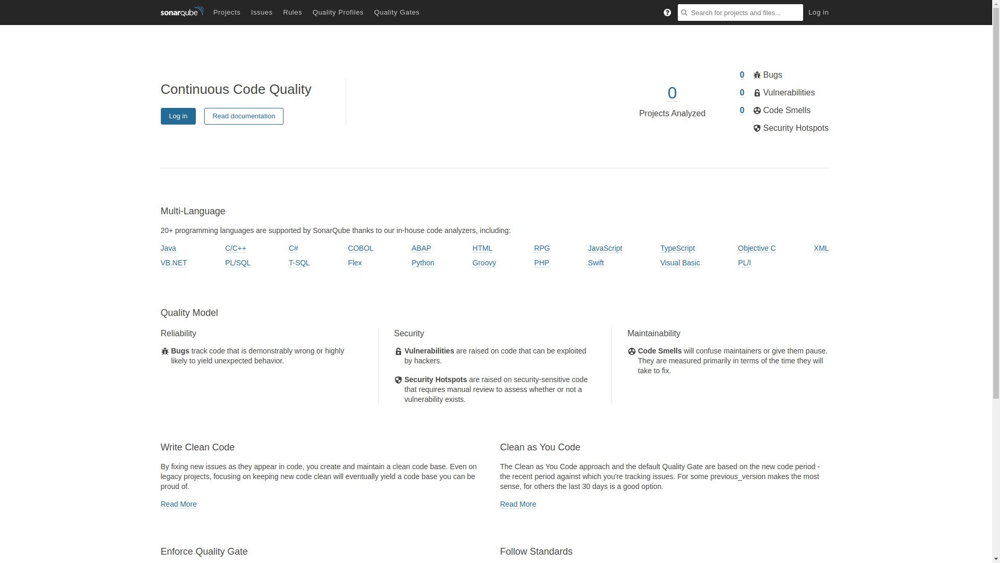

# Instalando SonarQube en CentOS 8

# Introducción

SonarQube es un software de código abierto desarrollado por una sociedad anónima fundada en 2008 cuya sede está en Suiza y que permite evaluar la calidad del código que se desarrolla y permite que los equipos de desarrollo crezcan elaborando software de calidad. Actualmente lo estoy descubriendo y me gustaría compartir un poco la instalación que hice en un CentOS 8. Actualmente hay una versión comunitaria y otras versiones que contienen más características pero que son de pago, nosotros nos vamos a centrar en la comunitaria.

# Requisitos recomendados
Los <a href="https://docs.sonarqube.org/latest/requirements/requirements/" target="blank">requisitos mínimos</a> para poder funcionar son los siguientes:
 - Mínimo 3 GB de RAM, 2GB que utilizará SonarQube y 1 GB que utilizará y debe quedar libre para el sistema. Aunque yo lo he podido hacer funcionar en un SO con 2GB de RAM.

- Tener instalado un sistema gestor de base de datos como:
  - PostgreSQL, será con el que trabajaremos.
  - Microsoft SQL Server
  - Oracle

- Tenemos que tener almacenamiento bastante rápido para las operaciones de I/O que realiza Elastic Search, sin embargo, si lo quieres para tu uso personal, no hace falta a menos que vayas a calcular la materia oscura del universo.

__Recomendaciones:__ Si estamos trabajando con máquinas virtuales, es indispensable hacer snapshot antes de empezar, o crear una máquina plantilla, anotar los cambios y luego hacerlos en nuestra futura máquina que irá a producción.

# Tareas y pasos previos
## Instalar el servicio solucionador de problemas de SELinux
Recordemos que CentOS hace uso de unas políticas de seguridad que trabajan junto con el kernel de Linux llamadas SELinux, y que permiten que no se ejecuten exploits 0 day entre otras cosas. Por eso es importante lidiar con las políticas y NO desactivarlas bajo ningún concepto.

Verificar que tenemos SELinux activo:
```
$ sestatus
```
Devolverá una salida como esta:
```
SELinux status:                 enabled
SELinuxfs mount:                /sys/fs/selinux
SELinux root directory:         /etc/selinux
Loaded policy name:             targeted
Current mode:                   enforcing
Mode from config file:          enforcing
Policy MLS status:              enabled
Policy deny_unknown status:     allowed
Memory protection checking:     actual (secure)
Max kernel policy version:      31
```
Si el valor `SELinux status: enabled` y `Current mode` es `enforcing`, está bien, si no tendremos que:
1. Revisar si tenemos el paquete `selinux-policy-targeted` y `selinux-policy` instalados.
2. Si tenemos desactivado SELinux, hacer un snapshot, y activarlo, editamos `/etc/selinux/config`
```
SELINUX=enforcing
```
3. Activarlo ahora
```
# setenforce 1
```
Por otro lado, si tenemos las políticas instaladas y activadas instalamos el servidor que nos ayudará a solucionar los problemas con las políticas.
```
# dnf install setroubleshoot-server
```
Revisar si tenemos algún ejecutable que se ha intentado saltarse las políticas:
```
# sealert -a /var/log/audit.log
```
El archivo de configuración de este servidor está: `/etc/setroubleshoot/setroubleshoot.conf`

## Crear usuario/grupo y home
Para crearlo:
```
# useradd sonarqube -m -d /opt/sonarqube
# passwd sonarqube 
```
Este creará el usuario con un home específico en `/opt/sonarqube` y le asignaremos una contraseña.

## Asignar los valores requeridos
Tenemos que tener en cuenta estos valores:

- `vm.max_map_count` tiene que ser >= 262144
- `fs.file-max` es >= 65536
- El usuario que ejecute SonarQube podrá abrir hasta un total de 65536 descriptores de archivos y también abrir al menos un total de 4096 hilos.

Podemos revisar estos valores:
```
$ sysctl vm.max_map_count
$ sysctl fs.file-max
$ ulimit -n
$ ulimit -u
```
Asignamos los valores si son inferiores:
```
# sysctl -w vm.max_map_count=262144
# sysctl -w fs.file-max=65536
# ulimit -n 65536
# ulimit -u 4096
```
Para que se conserven estos valores al arranque, creamos el siguiente archivo: `/etc/sysctl.d/99-sonarcube.conf`
```
vm.max_map_count=262144
fs.file-max=65536
```
Y creamos otro archivo: `/etc/security/limits.d/99-sonarqube.conf`
```
sonarqube - nofile 65536
sonarqube - nproc 4096
```

Recomiendan verificar si tenemos SECCOMP habilitado en el kernel de Linux, lo he comprobado y efectivamente está habilitado en el kernel oficial de CentOS 8. Sin embargo, conviene siempre hacerlo, en caso de que no lo tengans, tendrás que especificar la siguiente línea en su archivo de configuración o recompilar el kernel con estas opciones (__algo no recomendado__).
```
$ grep SECCOMP /boot/config-$(uname -r)
```
Si te devuelve esta salida, no hace falta que añadas nada.
```
CONFIG_HAVE_ARCH_SECCOMP_FILTER=y
CONFIG_SECCOMP_FILTER=y
CONFIG_SECCOMP=y
```
Si te devuelve lo contrario "y" por un "n", o no salen las líneas, tendrías que añadir esta línea al archivo en la `$HOME` de SonarQube: `$HOME/conf/sonar.properties` más adelante.
```
sonar.search.javaAdditionalOpts=-Dbootstrap.system_call_filter=false
```
## Instalando OpenJDK 11
Es necesario tenerlo instalado para poder continuar:
```
# dnf install java-11-openjdk-headless.x86_64
```
## Instalando y configurando PostgreSQL

Por defecto, tenemos la versión 10.6 disponible en los repositorios AppStream.

__NOTA:__ Aconsejo trabajar con tmux cuando estamos en el servidor para poder tener multisesión en la terminal virtual (_tty_).

Segundo, instalar PostgreSQL:
```
# dnf install postgresql-server
```
__NOTA__: Que sepamos que se ha creado un usuario y grupo `postgres` y que tiene por defecto el UID y GID 26 cuyo home es `/var/lib/pgsql`. Si vamos a utilizar alguna aplicación que precise de alguna configuración y necesite tener variables de entorno configuradas, tendremos que editar el archivo `/var/lib/pgsql/.bash_profile`

Inicializamos la base de datos:
```
# postgresql-setup --initdb
```
Si tenemos la siguiente salida es que ha ido todo bien:
```
 * Initializing database in '/var/lib/pgsql/data'
 * Initialized, logs are in /var/lib/pgsql/initdb_postgresql.log
```
Arrancando el servidor
```
# systemctl start postgresql.service
```
Si vemos la salida del `netstat -ptna` veremos que hay un servicio escuchando por el puerto 5432.
```
tcp        0      0 127.0.0.1:5432          0.0.0.0:*               LISTEN      21159/postmaster    
tcp6       0      0 ::1:5432                :::*                    LISTEN      21159/postmaster    
```
No vamos a configurar el acceso de manera remota porque es darle los caramelos a los niños directamente. 

## Cambiando la contraseña del usuario postgres
```
$ psql
postgres=# ALTER USER postgres WITH PASSWORD 'cambiaLaContrasenaAqui';
ALTER ROLE
```

## Crear los objetos en la BD
Los usuarios/grupos existen en PostgreSQL como ROLE, comento este paso para que no nos liemos administrando la base de datos en un futuro.

```
$ createuser -U postgres -W -D -l -P -R -S sonarqube
```
Opciones:
- `-U postgres`: Utilizamos el superusuarios de PostgreSQL
- `-D` evita que el ROLE nuevo cree bases de datos
- `-l` permite hacer login
- `-P` Nos pregunta la contraseña sin emitir caracteres como en el comando `passwd` o el login en una terminal virtual `tty`.
- `-R` el usuario no creará otros ROLE
- `-S` evita tener superprivilegios en todo el sistema

Revisamos que se creó el usuario correctamente, escalamos privilegios en el sistema y hacemos sesión como usuario `postgres`:
```
$ su - 
# su - postgres
$ psql -U postgres
postgres=# \du
                                   List of roles
 Role name |                         Attributes                         | Member of                                   
-----------+------------------------------------------------------------+-----------                                  
 postgres  | Superuser, Create role, Create DB, Replication, Bypass RLS | {}                                          
 sonarqube | | {} 
```
Salimos de la sesión en PostgreSQL utilizando `\l` y creamos la base de datos con el comando `createdb`:
```
$ createdb -U postgres -E UTF-8 -l en_US.UTF-8 -O sonarqube sonarqube
```
Opciones:
- `-U postgres`: Utilizamos el superusuarios de PostgreSQL
- `-E UTF-8`: Estamos diciendo que la base de datos debe tener UTF-8 como codificación por defecto.
- `-l en_US.UTF-8`: Le decimos que el idioma y codificación serán inglés americano y UTF-8
- `-O sonarqube`: Es el propietario de la DB
- `sonarqube`: Usuario que hemos creado

Revisamos que se ha creado la base de datos correctamente:
```
$ psql -U postgres
postgres=# \l
                                  List of databases
   Name    |   Owner   | Encoding |   Collate   |    Ctype    |   Access privileges                                   
-----------+-----------+----------+-------------+-------------+-----------------------                                
 postgres  | postgres  | UTF8     | en_US.UTF-8 | en_US.UTF-8 |                                                       
 sonarqube | sonarqube | UTF8     | en_US.UTF-8 | en_US.UTF-8 |   
```
Damos privilegios al usuario sonarqube:
```
postgres=# GRANT ALL PRIVILEGES ON DATABASE sonarqube TO sonarqube;
```
Y revisamos que ya los tiene:
```
postgres-# \l
                                   List of databases
   Name    |   Owner   | Encoding |   Collate   |    Ctype    |    Access privileges    
-----------+-----------+----------+-------------+-------------+-------------------------
 postgres  | postgres  | UTF8     | en_US.UTF-8 | en_US.UTF-8 | 
 sonarqube | sonarqube | UTF8     | en_US.UTF-8 | en_US.UTF-8 | =Tc/sonarqube          +
           |           |          |             |             | sonarqube=CTc/sonarqube

```
Hacemos copia de seguridad del archivo `/var/lib/pgsql/data/pg_hba.conf` 
```
# cp -av /var/lib/pgsql/data/pg_hba.conf /var/lib/pgsql/data/pg_hba.conf.bck.$(date +%d-%m-%y-%H:%M)
```
Editamos el archivo con nuestro editor favorito y comentamos las siguientes líneas:
```
#host    all             all             127.0.0.1/32            ident
#host    all             all             ::1/128                 ident
#local   replication     all                                     peer
#host    replication     all             127.0.0.1/32            ident 
#host    replication     all             ::1/128                 ident
```
Y añadimos las siguientes:
```
host    sonarqube       sonarqube       127.0.0.1/32            md5
host    sonarqube       sonarqube       ::1/128                 md5
```
__NOTA__: Si no tenemos IPv6 habilitado, evitamos copiar las líneas `::1/128`.
__NOTA__: Por otro lado, con este cambio, evitamos la conexión indiscriminada, y hacemos una política de denegamos todo y vamos permitiendo de forma controlada.

Reiniciamos el servicio:
```
# systemctl restart postgresql.service
```
Probamos a loguearnos:
```
$ psql -U sonarqube -W -h localhost -d sonarqube
```
Obtendremos el prompt:
```
psql (10.6)
Type "help" for help.

sonarqube=> 
```
Habilitamos el servicio en el arranque:
```
# systemctl enable postgresql.service
```
## ¿Qué pasa si nos hemos equivocado?
Pues podemos deshacer nuestros pasos de la siguiente forma:

__NOTA__: Es importante eliminar primero la base de datos que está asociada al role sonarqube porque PostgreSQL __no permite eliminar__ el usuario si hay permisos asociados al role.

Eliminar la base de datos:
```
$ dropdb --if-exists sonarqube
```
Eliminar el usuario:
```
$ dropuser --if-exists sonarqube
```

# Instalando SonarQube
Accedemos al sistema como usuario `sonarqube`  y descargamos el archivo de su <a href="https://www.sonarqube.org/downloads/" target="blank">sitio oficial.</a>

Recordemos que el usuario `sonarqube` tiene su `$HOME` en `/opt/sonarqube`.
```
$ unzip sonarqube*.zip
$ mv sonarqube*/* .
$ rm -rf sonarqube-*
```
Retiquetamos las etiquetas para SELinux, si te interesa guardar en un archivo el resultado puedes ejecutarlo con una redireccionando la salida a un archivo:
```
# restorecon -vR /opt/sonarqube/
```
No te asustes si aparecen muchas líneas como estas:
```
Relabeled /opt/sonarqube/lib/common/netty-buffer-4.1.32.Final.jar from unconfined_u:object_r:usr_t:s0 to unconfined_u:object_r:lib_t:s0
Relabeled /opt/sonarqube/lib/common/commons-io-2.6.jar from unconfined_u:object_r:usr_t:s0 to unconfined_u:object_r:lib_t:s0
Relabeled /opt/sonarqube/lib/jsw from unconfined_u:object_r:usr_t:s0 to unconfined_u:object_r:lib_t:s0
Relabeled /opt/sonarqube/lib/jsw/wrapper-3.2.3.jar from unconfined_u:object_r:usr_t:s0 to unconfined_u:object_r:lib_t:s0
```
Forman parte del proceso y al estar en modo _verbose_, se muestran.

Creamos un directorio para el almacenamiento de datos por parte de ElasticSearch
```
# mkdir -p /var/sonarqube/{data,temp}
# chown sonarqube:sonarqube /var/sonarqube/{data,temp}
```

Hacemos una copia de seguridad de este archivo: `/opt/sonarqube/conf/sonar.properties`
```
$ cp -av $HOME/conf/sonar.properties $HOME/conf/sonar.properties.bck.$(date +%d-%m-%Y-%H:%M)
```
Editamos el archivo `opt/sonarqube/conf/sonar.properties` añadiendo las siguientes líneas al final del archivo:
```
sonar.jdbc.username=sonarqube
sonar.jdbc.password=example@
sonar.jdbc.url=jdbc:postgresql://localhost/sonarqube
sonar.path.data=/var/sonarqube/data
sonar.path.temp=/var/sonarqube/temp
sonar.web.host=IP_DE_TU_HOST
sonar.web.port=9000
sonar.web.context=/sonarqube
```
__NOTA__: Si tratas de configurar el puerto por defacto del 1024, no podrás hacerlo si no eres `root`. Para ello tendrás que mirar alternativas con `setcap` o explorar otras vías, por lo que perderás más tiempo haciéndolo que creando una redirección en el cortafuegos.

Guardamos e iniciamos el proceso:
```
$ cd /opt/sonarqube/bin/linux-x86-64
$ ./sonar.sh start
```
Veremos una salida como esta:
```
Starting SonarQube...                                                                                                  
Started SonarQube.  
```
Habilitando el acceso al puerto desde `firewalld`:
```
# firewall-cmd --add-port 9000/tcp --permanent
# firewall-cmd --reload
```

¡Voilá! tendremos SonarQube arrancado y funcionando, puedes revisarlo en http://IP_SERVIDOR:9000/sonarqube



Si de lo contrario, has recibido un mensaje como este:
```
Starting SonarQube...                                                                                                  
Stopped SonarQube.  
```
Hay algo que no está funcionando. ¿Cómo revisarlo?
- Revisar los logs de: `/opt/sonarqube/logs` 
- Revisar que no hayan problemas en SELinux con `# sealert -a /var/log/audit/audit.log`
- Comprobar que estamos ejecutándolo con el usuario y grupo `sonarqube`
- Comprobar que los permisos de los directorios y ejecutables son del usuario que tocan:
```
# find /opt/sonarqube/ ! -user sonarqube
# find /opt/sonarqube/ ! -group sonarqube
# find /var/sonarqube/ ! -user sonarqube
# find /var/sonarqube/ ! -group sonarqube
```
Si devuelven salidas quiere decir que esos archivos/directorios no tienen los permisos correspondientes.
- Comprobar que tenemos OpenJDK correctamente instalado:
```
$ whereis java
java: /usr/bin/java /usr/lib/java /etc/java /usr/share/java /usr/share/man/man1/java.1.gz
```
- Verificar que el servicio de PostgreSQL está corriendo:
```
$ systemctl status postgresql.service
```
- Verificar que podemos acceder mediante usuario `sonarqube` a la base de datos de `sonarqube`:
```
$ psql -U sonarqube -W -h localhost -d sonarqube
```
- Revisar que la configuración de base de datos, servidor web... corresponde con la realidad. `/opt/sonarqube/conf/sonar.properties`
- Mirar si los archivos tienen los valores que tocan en `/etc/sysctl.d/99-sonarqube.conf` y `/etc/security/limits.d/99-sonarqube.conf`

## Creando un servicio
¡Ahora que ya funciona! Es hora de crear un servicio para que arranque con la máquina.

Creamos en el directorio `/etc/systemd/system/multi-user.target.wants/sonarqube.service`

Y añadimos las siguientes líneas:
```
[Unit]
Description=Servicio que gestiona SonarQube
After=postgresql.service

[Service]
Type=forking
User=sonarqube
Group=sonarqube
ExecStart=/opt/sonarqube/bin/linux-x86-64/sonar.sh start
ExecStop=/opt/sonarqube/bin/linux-x86-64/sonar.sh stop
PIDFile=/opt/sonarqube/bin/linux-x86-64/SonarQube.pid
LimitNOFILE=65536
LimitNPROC=4096
Restart=always

[Install]
WantedBy=multi-user.target

```

Recargamos la nueva configuración del servicio:
```
# systemctl daemon-reload
```
Iniciamos el servicio
```
# systemctl start sonarcube.service
```
Habilitamos el servicio al arranque:
```
 systemctl enable sonarcube.service
```
Para confirmar que todo va a funcionar si hay un apagón o un reinicio programado, hay que hacer un reinicio del servidor y comprobarlo, no basta con _ya lo haré_, _cuando se pueda_, hay que hacerlo.
```
# systemctl reboot
```
Y con esto, habremos instalado SonarQube en CentOS 8 y con SELinux habilitado (por favor seguir las buenas prácticas). Más adelante, según vaya viendo más sobre SonarQube iré publicando más tutoriales.