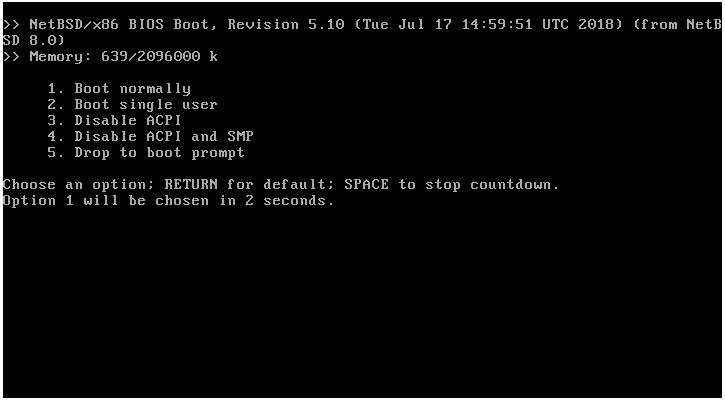

# Instalar NetBSD 8.0

NetBSD a pesar de ser muy poco conocido, es uno de los sistemas operativos más portables en cuánto a plataformas se refie de todo el mundo. Es tan portable que incluso llega a funcionar en una tostadora como podemos ver en la siguiente imagen.

NetBSD surgió de hecho con esa idea, poder llegar a todos las arquitecturas posibles y así lo han demostrado. Sus orígenes se remotan en 1993, cuando Chris Demetriou, Theo de Raadt, Adam Glass y Charles M. Hannum formaron el proyecto NetBSD con el fin de proveer este magnífico sistema derivado de la versión original UCB 4.3BSD y 386BSD. Posteriormente, para poder sumar más personas al proyecto, portaron código fuente de la versión 4.4BSD-Lite.

# ¿En qué plataformas corre NetBSD?
NetBSD puede correr en un total de 15 arquitecuras diferentes como SPARC, SPARC64, AMD/Intel (32/64 bits), ARM, PowerPC entre otras más que puedes encontrar en esta lista de [aquí](http://www.netbsd.org/ports/#ports-by-cpu?target=_blank).

# Primeros pasos
Antes de empezar, tenemos que saber qué tipo de CPU estamos utilizando, si es ARM, x86, x86_64... y descargar la [imagen](http://www.netbsd.org/releases/index.html?target=_blank) que corresponda con nuestra arquitectura, comprobar la [suma de verificación](https://ftp.netbsd.org/pub/NetBSD/security/hashes/NetBSD-8.0_hashes.asc) del archivo para curarnos en salud, y luego generar la imagen autoarrancable pues en caso de ser un USB, suele ir bien Unetbootin o la herramienta de discos de GNOME.

# Interfaz de instalación
Como podemos ver la interfaz de la instalación en modo no gráfico pero intuitivo, se pueden utilizar atajos de teclado que aparecen en el lado izquierdo de las opciones que nos aparecen.

# Pasos

Vamos a simplificar la instalación y explicar lo necesario por cada punto.
  1. Seleccionar el idioma del teclado
  2. Instalar NetBSD en el disco duro y aceptar que la geometría es correcta
   * **IMPORTANTE: NO MODIFICAR LA GEOMETRÍA DEL DISCO, o podrás desecharlo a la basura.**
  3. Procederemos a editar la tabla de particiones MBR y no hacer uso de todo el disco, así nos acostumbraremos a particionar estos sistemas.
  4. Escogemos el espacio libre del disco duro, y creamos una sola partición del tipo NetBSD y marcando los _flags_ `activa, instalar`

   
 * **¿Por qué una?**: Los sistemas BSD por defecto utilizan un sistema de particiones "_poco común_". Se escoge una sola partición primaria, y posteriormente se dividen en _subparticiones_ llamados _slices_, hay que escoger bien las particiones y sus tamaños porque luego no se podrán modificar.
 **
  5. Instalamos el código de arranque MBR
  6. Establecemos el tamaño de las particiones de NetBSD, lo que en Linux sería `/var`, `/home`, `/`... nosotros utilizaremos `/` y swap.

  

  7. Le asignamos un nombre a la etiqueta que llevará el disco duro
  8. Confirmamos su instalación
  9. Utilizamos la consola BIOS, no vamos ha hacer uso de puertos COM
  10. Instalación completa
  11. CD-ROM / DVD / install image media
    
  12. Configuración de elementos adicionales, en este apartado podemos asignarle contraseña al usuario `root`, configurar el huso horario, shell de `root`...
    
  13. Si no tenemos nada más que añadir, podemos finalizar la instalación

# Arranque
Una vez que lo tengamos instalado, y efectuemos el reinicio, podemos ver como sale el gestor de arranque de NetBSD en la siguiente imagen:

Cuando nos logueemos, veremos un mensaje de bienvenida del equipo de NetBSD

¡Ya tendremos NetBSD corriendo en nuestro sistema!

# Referencias
  * [NetBSD History](http://www.netbsd.org/about/history.html?target=_blank)
  * [NetBSD Documentation](http://www.netbsd.org/docs/guide/en/chap-intro.html?target=_blank)

