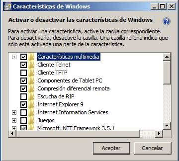

# Introducción
Telnet es un protocolo cuya función es interconectar dos dispositivos de redes cualesquiera para obtener una administración o gestión remota. Su publicación fue en el 1983 bajo el RFC854 (_Request for Comments_). Este utiliza el protocolo TCP (_Transmission Control Protocol_) o lo que es lo mismo, Protocolo de Control de Transmisión con la finalidad de no perder información cuando se tiene una sesión abierta a través de Telnet.

También se le ha atribuido algunos usos como enviar peticiones a servidores Web entre otras cosas. 

_NOTA: Tenemos que tener en cuenta, que Telnet debe tener el puerto 23 abierto para poder funcionar._

# Instalación del cliente
A continuación veremos como instalar el cliente de Telnet tanto en Linux como en Windows.

## Linux
Procederemos a instalarlo en las diferentes distribuciones populares:

### Fedora
No más sencillo que:
```
# dnf install telnet
```
### CentOS
Parecido a Fedora:
```
# yum install telnet-server
```

### OpenSUSE Leap o Tumbleweed
Más fácil imposible:
```
$ sudo pacman -S telnet
```

### Gentoo
Inconfundible:
```
$ sudo emerge -av telnet-bsd
```

### Ubuntu, Debian, derivados
Sin dudarlo:
```
$ sudo apt-get install telnet
```

### Código fuente
Procederemos a explicar cómo instalarlo mediante código fuente:
 1. Descargamos el src desde el siguiente [enlace](http://ftp.isr.tecnico.ulisboa.pt/pub/MIRRORS/ftp.suse.com/people/kukuk/ipv6/telnet-bsd-1.2.tar.bz2?target=_blank).
 2. Descomprimimos el archivo
 3. Configuramos el prefix
 	```
 	./configure --prefix=/usr
 	```
 4. Compilamos
 	```
 	make
 	```
 5. Instalamos
 	```
 	make install
 	```
 6. Y ya podemos utilizarlo

 Nota: Tenemos que acordarnos que si utilizamos otro `PREFIX` que no se encuentre recogido dentro de la variable `PATH` de algún fichero en `/etc/profile.d/` o `~/.bash_profile` no saldrá disponible a menos que ejecutes el comando telnet con ruta absoluta.

## Windows
Telnet en Windows no lleva mucha complicación ya que en la mayoría de versiones es el mismo procedimiento a realizar.

1. Nos dirigimos al Panel de control
2. Activar características de Windows
3. Marcar el _checkbox_ Cliente Telnet
4. Reiniciar y ya podemos acceder al cliente desde `cmd.exe`

[owl-carousel items=1 margin=10 loop=true autoplay=true autoplayHoverPause=true nav=true]


[/owl-carousel]

# Ejecutando Telnet
Abrimos un intérprete de comandos tanto en Linux `bash`, `gnome-terminal`... como en Windows `cmd.exe` o `PowerShell` y ejecutamos telnet:
`telnet`

## Conectándonos a un servidor
Para conectarnos basta con hacer:
```
telnet IP_SERVIDOR
```

# Instalación de un servidor
En este punto instalaremos un servidor de Telnet tanto en Linux como en Windows.

## Linux
Distribuciones

### Fedora o CentOS
Tan fácil como:
```
# dnf install telnet-server
# systemctl start telnet.socket
```

Y ya podremos conectarnos, por ejemplo, desde `localhost`:
```
$ telnet 127.0.0.1
```

### OpenSUSE Tumbleweed / Leap

Es un procedimiento un poco más elaborado que el de Fedora:
```
$ sudo zypper in telnet-server
$ sudo sed -ie 's/yes/no/g' /etc/xinet.d/telnet
```
Le decimos a `xinetd(1)` que incie telnet
_Nota: `xinetd(1)` es un servicio que administra las conexiones a determinados servicios utilizados por Internet como en este caso, Telnet._

Iniciando el servidor:
```
$ sudo systemctl start xinetd
```

Para probar el servidor, nos intentamos loguear con nuestra propia máquina (_loopback_):
```
$ telnet 127.0.0.1
```

### Debian, Ubuntu y derivados
Si en OpenSUSE es `xinetd(1)`, aquí la gente de Debian, Ubuntu y derivados hacen uso de `inetd(1)`, que es el servicio previo a `xinetd(1)`.
```
$ sudo apt-get install telnetd
```

Esto bastará para lanzar automáticamente el servicio:
```
$ telnet 127.0.0.1
```

Sin embargo, si queremos confirmar y verificar de que se iniciará `telnet(1)` al arranque del sistema con `inetd(1)` hay que verificar el archivo `/etc/inetd.conf` y fijarnos en la línea que nos dice:
```
telnet stream tcp nowait telnetd /usr/sbin/tcpd /usr/sbin/in.telnetd
```

Y añadirlo al arranque:
```
$ sudo systemctl enable inetd
```

### Gentoo (systemd)
Para instalar el servidor de Telnet en Gentoo bastará con hacer los siguientes pasos:

```
$ sudo emerge -av telnet-bsd
```

Generamos este fichero en el directorio `/etc/systemd/system/telnetd.socket`
```
Description=Telnet Server Activation Socket
Documentation=man:telnetd(8)

[Socket]
ListenStream=23
Accept=true

[Install]
WantedBy=sockets.target
```

Posteriormente, creamos otro fichero en `/etc/systemd/system/telnetd@.service`
```
[Unit]
Description=Telnet Server
After=local-fs.target

[Service]
ExecStart=/usr/sbin/in.telnetd
StandardInput=socket
```
Lanzamos el servidor:
```
# systemctl start telnetd.socket
```
Probamos si funciona con:
```
$ telnet 127.0.0.1
```

Añadiendo `telnetd(8)` al arranque:
```
# systemctl enable telnetd.socket
```

Deshabilitándolo:
```
# systemctl disable telnetd.socket
```


### Código fuente
Para instalarlo en una distribución Linux utilizando systemd como gestor de servicios, hay que acordarse en qué ruta hemos instalado telnetd. Una vez la tengamos, sólo tendremos que crear los ficheros que hemos añadido en el paso de Gentoo con el `PREFIX` correcto.

Creamos y añadimos la siguiente información `/etc/systemd/system/telnetd.socket`
```
Description=Telnet Server Activation Socket
Documentation=man:telnetd(8)

[Socket]
ListenStream=23
Accept=true

[Install]
WantedBy=sockets.target
```

Luego creamos el fichero `/etc/systemd/system/telnetd@.service`
```
[Unit]
Description=Telnet Server
After=local-fs.target

[Service]
ExecStart=/usr/sbin/in.telnetd
StandardInput=socket
```

Probemos si funciona con:
```
$ telnet 127.0.0.1
```

## Windows

Para instalar el servidor de Telnet en Windows, los pasos generalmente son los mismos tanto para 7, 8 o 10.

1. Nos dirigimos al Panel de control
2. Activar características de Windows
3. Marcar el _checkbox_ Servidor Telnet
4. Reiniciar
5. Ejecutamos `services.msc`
6. Buscamos el apartado servidor Telnet -> Clic derecho -> Propiedades
7. Pinchar en Deshabilitado -> Manual -> Iniciar (_Si queremos que inicie con el sistema lo pasamos a automático_)

[owl-carousel items=1 margin=10 loop=true autoplay=true autoplayHoverPause=true nav=true]


[/owl-carousel]

# Referencias
1. [RFC854](https://tools.ietf.org/html/rfc854?target=_blank)
2. [Microsoft's doc social network](https://social.technet.microsoft.com/wiki/contents/articles/910.windows-7-enabling-telnet-client.aspx?target=_blank)
3. [Google](https://google.es?target=_blank)
4. [Gentoo](https://wiki.gentoo.org/wiki/Systemd)
