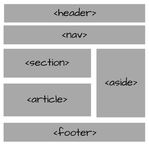

## ¿Qué es HTML?

HTML proviene de las siglas en inglés HyperText Markup Language, traducido al español "Lenguaje de etiquetas de Hipertexto". Es un lenguaje (no de programación) interpretado que principalmente se caracteriza por el uso de unas "etiquetas". Estas permiten generar y organizador una serie de elementos que se representarán dentro de una página Web. 

## Funcionamiento

El código que se escribe será interpretado por un navegador Web como es el caso de Google Chrome, Mozilla Firefox, Opera, Microsoft Edge. Estos exploradores leerán lo que se ha escrito, lo interpretará y lo representará dentro de nuestro documento Web en cuestión de milisegundos.

## Sintaxis
El 95% de las etiquetas empiezan siempre empiezan y acaban con elemento que queramos representar en el documento Web.

`<h1>Ejemplo de encabezado</h1>`, esto representará un encabezado con un tamaño de fuente superior al resto de encabezados y con un sombreado añadido.

Sin embargo, existen etiquetas que contienen el nombre del elemento junto con una serie de atributos pero sin mencionar el nombre del elemento en el cierre.
`<input type="button">`, esta etiqueta por ejemplo generará un tipo de elemento de información de entrada en modo botón.
```
   Atributo		Contenido
   ________     _________
     | 			    |
<p attr="valor">Texto ej</p>
---	     -----			 ---
 |						  |
 |      Etiquetas 		  |
 __________________________
 ```

Además, veremos cómo las etiquetas configuran un árbol de familias padre-hijo ya que pueden anidarse indefinidamente. 

## Tipos de atributo
Existen una serie de atributos globales estandarizados para los elementos de nuestro documento que nos permiten definir eventos como cuando pulsemos un clic que haga una determinada acción (esto es en relación con JavaScript que veremos más adelante), identificación de un elemento como único como es el caso del atributo id... podemos encontrar una lista de estos atributos [aquí](https://developer.mozilla.org/es/docs/Web/HTML/Atributos_Globales?target=_blank)

Por otro lado, también existen tributos sin valor como podemos destacar placeholder, controls... de los cuáles hablaremos de ellos más tarde.

## Etiquetas

`<!DOCTYPE html>`
Nos permite definir que lenguaje de etiquetas debe interpretar el navegador. En este caso comunicamos al explorador que debe interpetar la versión 5 de HTML.

`<html></html>`
Constituye el comienzo y final del documento, si el contenido junto con los elementos se encuentran fuera de estas etiquetas, nos arriesgamos a que los navegadores no logren interpretarlo.

**Nota: El atributo `lang=""` permite definir el idioma del documento, si es español deberá llevar como valor "es", si es Francés, "fr" y viceversa. Más información en la página de la [w3](https://www.w3.org/International/questions/qa-html-language-declarations.es?target=_blank)**

`<head></head>`
Permite definir una cabecera en nuestro documento en el cual, le otorgamos cierta información descriptiva al mismo con el uso de las siguientes etiquetas:
`<title></title>`: Define el título del documento, este lo veremos representado en el título de la pestaña y de la ventana del explorador Web.

Las etiquetas `<meta>`
Estas permiten definir la información tanto del autor como palabras clave, descripción, codificación...

`<meta author="Nombre del autor">`
`<meta keywords="Palabras, clave``<meta description="Descripción del documento">`
`<meta charset="utf-8">`

Etiquetas opcionales
`<link>`: Es una etiqueta muy utilizada cuando se quiere vincular una hoja de estilos elaborada con CSS3. Las hojas de estilos permiten añadir determinados diseños personalizados para cada elemento de nuestro documento Web. Tienen una sintaxis propia que explicaremos más adelante.

`<body>`
La etiqueta `<body></body>` permite definir el cuerpo de nuestro documento Web. Aquí añdiremos todos los elementos con los que el usuario interactuará como es el caso de los párrafos, imágenes, videos, enlaces...etc

`<footer></footer>`
Este elemento es el último dentro del documento Web que estemos redactando, permite añadir un pie de página al documento con la información que nosotr@s estimemos oportuna.

## Comentarios
Los comentarios nos permiten puntualizar determinadas partes del código para explicar que sirve, anotar cómo hemos llegado hasta ahí o simplemente salvarnos de una metedura de pata. Muchas personas no hacen uso de los comentarios arriesgandose sobre todo en un proyecto en el que hay más personas involucradas frene productivamente su desarrollo.

Para comentar simplemente tendremos que utilizar estos caracteres `<!--` para la apertura y `-->` para el cierre.

`<!-- -->`

## Estilizando
Todos los elementos poseen una serie de atributos por defecto sobre su estilo que pueden modificarse aplicando una serie palabras clave que se basan en un lenguaje de estilos llamado CSS que veremos en los siguientes posts.

Con él, podemos definir un fondo de pantalla mucho más vistoso, modificar el tamaño y familia de la tipografía que queremos utilizar, modificar la posición de los elementos...

Para poder modificar los estilos se pueden hacer de 3 maneras.
* Etiqueta
	* Añadiendo la etiqueta `<style></style>` dentro del elemento `<head></head>`
* Atributo de un elemento
	* `<div style="background-color:black"></div>`
* Hoja referenciada
	* Adjuntando en `<head></head>` un enlace a una hoja de estilos de la siguiente manera:
	`<link rel="stylesheet" href="ruta_absoluta_o_relativa_de_la_hoja_de_estilos.css">`

La norma de un buen desarrollador es, **nunca mezclarás**. Con esto queremos decir, que debemos escoger siempre la 3 opción ya que es más legible para los demás y para uno mismo, ya que si no funciona determinado estilo y tenemos todos ellos desperdigados por los elementos, nos volveríamos loc@s para encontrarlos.

## Encabezados
Los encabezados nos permiten pre-formatear un texto con un sombreado y un tamaño específico. Nos permiten describir el contenido que vamos a comentar. Un ejemplo sencillo son los titulares de un periódico.

Otorgando estilo al texto

Existen hasta 6 tipos de encabezados:

<h1>Encabezado</h1> 
`<h1>Encabezado 1</h1>`
<h2>Encabezado 2</h2>
`<h2>Encabezado 2</h2>`
<h3>Encabezado 3</h3>
`<h3>Encabezado 3</h3>`
<h4>Encabezado 4</h4>
`<h4>Encabezado 4</h4>`
<h5>Encabezado 5</h5>
`<h5>Encabezado 5</h5>`
<h6>Encabezado 6</h6>	
`<h6>Encabezado 6</h6>`	

## Párrafo
Nos permiten representar el contenido en forma de párrafos. Esto genera un salto de línea cada vez que lo definimos.
`<p></p>`

### Énfasis dentro de un párrafo
Si queremos destacar un determinado contenido dentro de un párrafo, utilizaremos la etiqueta `<span></span>`.

## Separadores de contenido
Cuando queremos representar un contenido debidamente estructurado y organizado no lo podemos representar solamente con etiquetas que den formato al contenido. Necesitaremos unas etiquetas que nos permitan representar el contenido como queramos. 

Para esto se inventaron los div's. La palabra proviene del inglés "division" o lo que es lo mismo, un contenedor que divide la página en secciones. Estas secciones son muy útiles para agrupar elementos en un documento HTML.

Con la llegada de HTML5 los divs cobran un significado semántico y ahora tenemos las siguientes etiquetas:
* `<header></header>`: Dónde especificamos qué añadir en la cabecera de la página, el equivalente en el viejo estándar es `<div class="header"></div>`
{.right}
* `<nav></nav>`: Utilizado para generar una barra de navegación, en el viejo estándar sería `<div class="menu"></div>`

* `<section></section>`: Representa una sección general dentro de un documento. Antes se hacía uso de `<div class="content"></div>`

* `<article></article>: Se utiliza para representar un artículo, que si se anidan, quiere decir que todos los artículos estarán relacionados con el artículo padre. Antes se utilizaba, <div class="article"></div>`
* `<aside></aside>`: Se considera un elemento independiente del contenido ya que se suele utilizar para elaborar barras laterales, elementos publicitarios...

* `<footer></footer>`: Añadimos un pie de págin al documento. `<div id="footer"></div>`

## Matizando el contenido
Se puede añadir ciertos matices al contenido mediante las siguientes etiquetas:
* `<em>`: <em>Permite mostrar el texto en cursiva</em>
* `<strong>`: <strong>Añade un énfasis en negrita</strong>
* `<u></u>`: <u>Subrayado de texto</u>
* `<strike></strike>`: <strike>Tacha el texto</strike>
* `<sup></sup>`: <sup>Crear un texto con formato de exponente</sup>
* `<sub></sub>`: <sub>Crea un texto con formato de texto más bajo y más pequeño.</sub>

## Salto de línea
Si queremos añadir un espacio entre elementos, se puede llevar a cabo haciendo uso de `<br>`. También podemos añadirlo dentro de un párrafo y dividirlo sin afectar la posición completa del mismo con respecto al resto de elementos.

`<p>`Esto es un ejemplo de un párrafo que dividiremos en dos. `<br>`
Se visualizará un salto de línea dentro de este párrafo`</p>`

## Listas
En HTML tenemos a disposición 2 tipos de listas, una lista ordenada con la que tendremos ítems organizados por números y por otro lado, una lista sin ordenar con otros tipos de símbolos para representar a los ítems de la lista.

### Lista sin orden
Para elaborarla utilizamos `<ul>` "unordered list" `</ul>` junto con los ítems `<li></li>` "list items".

Por ejemplo, categoría de Frutas con algunas de ellas:
```
<ul>
	<li>Pomelo</li>
	<li>Fresa</li>
	<li>Melocotón</li>
</ul>
```
<ul>
	<li>Pomelo</li>
	<li>Fresa</li>
	<li>Melocotón</li>
</ul>
### Lista ordenada
Para construirla utilizamos la etiqueta `<ol></ol>` además de `<li></li>` para definir los ítems.

ToDo, tareas que hacer
```
<ol>
	<li>Hacer la comida</li>
	<li>Desfragentar Windows</li>
	<li>Instalar Antivirus Windows</li>
</ol>
```
<ol>
	<li>Hacer la comida</li>
	<li>Desfragentar Windows</li>
	<li>Instalar Antivirus Windows</li>
</ol>
## Vínculos
Los vínculos permiten conectar una página con otra, pueden utilizarse rutas relativas o absolutas siempre y cuando el fichero exista.
`<a href="https://www.echemosunbitstazo.es">Echemos un bitstazo</a>`

`<a>` proviene del inglés "anchor" que en español quiere decir "_ancla_".

Hay un atributo que es bastante útil y muy utilizado para definir el comportamiento del enlace. Este atributo recibe el nombre de target. Es muy útil sobre todo para los visitantes que quieran consultar una información enlazada en el documento sin tener que perderlo de vista. 
Para abrir el enlace en una nueva ventana, se hace uso del atributo `target="_blank"`. Tambien tenemos los valores:
* `_self`: Acción por defecto, se abre la página en la misma página
* `_parent`: Se abre el documento a cuerpo completo en una ventana
* `framename`: Se abre el documento en un frame

## Creando un anclaje

Podemos enlazar varios contenidos en el mismo documento. Una de las utilidades es la construcción de un índice a partir de los encabezados de título.

Especificamos en un encabezado el id, y mediante una lista, generamos un enlace que apunte hacia ese id seguido de almohadilla.

```
<body>
	<ol>
		<li><a href="#intro">Introducción</a></li>
		<li><a href="#howto">¿Cómo hacerlo?</a></li>
		<li><a href="#resources">Fuentes</a></li>
	</ol>
	<h1 id="intro">Introducción</h1>
	<p>Lorem Ipsum</p>
	<h1 id="howto">¿Cómo hacerlo?</h1>
	<p> Ipsum Lorem</p>
	<h1 id="resources">Fuentes</h1>
	<p>LoIpSum</p>
</body>
```

## Botón
Se puede añadir un botón.
`<button>Texto a mostrar</button>`

Nos puede servir cuando desarrollemos en JavaScript que cada vez que pulsemos el botón ocurra algo como en el siguiente ejemplo:
<button onclick="alert('Esto es un botón')">Púlsame</button>

## Imágenes
Para añadir imágenes tipo .jpeg, .png, .jpg, .gif... tenemos que utilizar la etiqueta ``. El valor que recibirá el atributo SRC es la URL de la imagen que puede añadirse desde una rula relativa o absoluta.

Hay un atributo específico que se utiliza para aquellas personas que tengan dificultades en la visión o no puedan ver directamente, existen "lectores de pantalla" que leen el texto generando un audio para que puedan escuchar cuál es el contenido del documento.


### ¿Pero cómo lee una imagen un "lector de pantalla"?
No la lee, básicamente toma el valor del atributo, que en este caso suele ser una descripción y se lo comunica a la persona que accedió al documento.

``


En caso de que falle la carga de la imagen, también podemos leer la descripción, o si situamos el cursor encima de ella.

Por otro lado permite mejorar el SEO (Search Engine Optimization) ya que los motores de búsqueda como Google no pueden indexar las imágenes, no las lee directamente y utilizan este atributo para tener una descripción y así posicionar mejor tu sitio.

## Añadiendo un video
Antaño, para añadir un video al sitio Web, necesitamos tener un reproductor que estaba elaborado en Adobe Flash Player y rezar porque funcionase. Sin embargo, con el tiempo, esto se ha solucionado implementando la etiqueta `<video></video>`

<video src="/blog/mastering-html5/342125205.mp4" controls>Formato de video no soportado</video>

Esta etiqueta requiere del atributo src que apunte a la fuente del video. Se puede forzar la resolución del video utilizando los atributos:
* `width`: Para el ancho en píxeles
* `height`: Para la altura también en píxeles

Para especificar el MIME-type del video, se utiliza el atributo `type="x/y"`.
`type="video/mp4"`. Un MIME-type es básicamente informar al documento del tipo de contenido que se quiere mostrar. Aquí tienes una lista con multitud de [tipos](https://developer.mozilla.org/es/docs/Web/HTTP/Basics_of_HTTP/MIME_types?target=_blank)

Por último el atributo controls que no posee un valor alguno, permite mostrar los controles del reproductor.

Está muy bien añadir como contenido dentro de la etiqueta video (que como hemos visto queda vacía) un texto que comente "Video no soportado", para que aquella persona que espere a ver el video comprenda que su navegador no lo soporta.

## Añadiendo un audio
Exactamente se añade igual como el video solo que cambia la etiqueta `<video>` por `<audio>` y que por obligación, hay que especificar el atributo controls, si no, no funcionará a pesar de haberlo encontrado en su ruta.

<audio src="/blog/mastering-html5/Matty_M_September_Jam.mp3" controls></audio>

## Tablas
Si queremos organizar la información en tablas, simplemente tendremos que utilizar las siguientes etiquetas:

* `<table></table>`: Construye una tabla.
* `<thead></thead>`: Define el encabezado de la tabla.
* `<th></th>`: Se incluye dentro de la etiqueta `<thead></thead>` para definir el nombre de las columnas
* `<tbody></tbody>`: Define el contenido que irá en la tabla
* `<tfoot></tfoot>`: Pie de la tabla
* `<tr></tr>`: Define una nueva fila, requerido para `thead`,`tbody`, `tfoot`
* `<td></td>`: Se utiliza para definir el contenido de las celdas que van dentro de `<tbody>` y `<tfoot>`

Un ejemplo más sencillo:

<table>
	<thead>
		<tr>
			<th>Cabecera tabla C1</th>
			<th>Cabecera tabla C2</th>
			<th>Cabecera tabla C3</th>
		</tr>
	</thead>
	<tbody>
		<tr>
			<td>Celda F1:C1</td>
			<td>Celda F1:C2/td>
			<td>Celda F1:C3</td>
		</tr>
		<tr>
			<td>Celda F2:C1</td>
			<td>Celda F2:C2/td>
			<td>Celda F2:C3</td>
		</tr>
	</tbody>
	<tfoot>
		<tr>
			<td>Pie de tabla C1</td>
			<td>Pie de tabla C2</td>
			<td>Pie de tabla C3</td>
		</tr>
	</tfoot>
</table>

Y representada en forma de código:

```
<table>
	<thead>
		<tr>
			<th>Cabecera tabla #1</th>
			<th>Cabecera tabla #2</th>
			<th>Cabecera tabla #3</th>
		</tr>
	</thead>
	<tbody>
		<tr>
			<td>Celda F1:C1</td>
			<td>Celda F1:C2</td>
			<td>Celda F1:C3</td>
		</tr>
		<tr>
			<td>Celda F2:C1</td>
			<td>Celda F2:C2</td>
			<td>Celda F2:C3</td>
		</tr>
	</tbody>
	<tfoot>
		<tr>
			<td>Pie de tabla</td>
			<td>Pie de tabla</td>
			<td>Pie de tabla</td>
		</tr>
	</tfoot>
</table>
```

### Añadiendo espacio
Se puede añadir un espacio en las columnas cuando no hay contenido que representar mediante el atributo `colspan="x"` en un `<td>` ó `<th>`, donde X es un número entero.

No obstante, también podemos hacerlo en las filas con el atributo `rowspan="y"`, dónde y es un valor entero.

## Formularios
En HTML se nos permite generar formularios para recoger datos.

<em>**NOTA: No mostraremos en esta misma página los inputs, porque dan lugar conflictos con estilo y JS, sin embargo, hemos añadido el mismo código con la descripción en el servicio "JSFiddle" que puedes acceder desde [aquí](https://jsfiddle.net/sincorchetes/rgnxpjqu/10?target=_blank). Solo hay que pulsar en RUN y en la parte inferior derecha aparecerá una pequeña ventana con el código resultante.
**</em>

`<form></form>`: Creamos los formularios y los cerramos de la siguiente forma. Esta etiqueta posee una serie de atributos muy especiales como es `method=""` y `action=""`.
* `method=""`: Especificamos el encabezado HTTP que queramos utilizar, existen 5, pero comentaremos los 3 más utilizados:
  * `GET`: Los datos que se envían se pueden ver a través del campo URL del explorador. Se suele utilizar para obtener información de un servidor de un recurso específico.
  * `POST`: Los datos se envían como si fuera un modelo de caja negra, no se ven. Este método se suele utilizar para enviar información al servidor y que este sea recepcionado por un lenguaje o sistema de fondo.
  *  `PUT`: Muy común para subir archivos.

* `action=""`: Define a qué ruta enviar la información, si hay un fichero que lo trata del lado del servidor elaborado con PHP, Ruby on Rails.. o que sea procesado con JS mediante un AJAX... mil posibilidades.

### Etiqueta <label>
Esta etiqueta se utiliza para asociar un control de un formulario y se vincula con un input, este provee de una breve descripción. Este hace uso de un atributo llamado `for` cuyo valor es el id del input.

Por ejemplo:
<label for="idExample">Nombre y apellidos:</label>
<input type="text" id="idExample">

## Elementos del formulario

Un formulario no es un formulario solo por tener una etiqueta que lo defina, si no tenemos una serie de elementos que nos permitan interactuar con la persona que se encuentra detrás de la pantalla, poco podemos hacer con él.

### Información tipeada
Los siguientes elementos nos permiten recoger información escrita por el usuario.

* Permite recoger texto en una sola línea. `<input type="text">`
* Recuadro ajustable de texto en el que se puede visualizar lo escrito en múltiples líneas. `<textarea></textarea>`
* Campo tipo input que tiene una validación que no permite al usuario enviar la información si no inserta una dirección mail válida. `<input type="email">`
* Elemento del formulario que permite verificar si la URL introducida es correcta, sin embargo, en aquellos navegadores que no soporten este campo se tornará en un input tipo texto. `<input type="url">`
* Campo tipo text con opciones adicionales como un icono con el que se puede eliminar lo previamente escrito además de soportar (según el navegador) un pequeño historial de búsqueda realizada. `<input type="search">`
* Elemento del formulario en un navegador de escritorio no se aprecia la diferencia, pero si utilizamos un smartphone o un dispositivo móvil. A la hora de escribir, el teclado se alternará mostrando únicamente el "dial pad". `<input type="tel">`

### Fecha y hora
Si queremos recoger campos de fecha y de hora, utilizaremos:

* Permite establecer una fecha. `<input type="date">`
* Permite escoger un mes del año y muestra el año del mes seleccionado. `<input type="month">`
* Muestra la semana seleccionada y muestra el año de la semana seleccionada. `<input type="week">`
* Permite seleccionado una fecha (MM/DD/YYYY) y además, hora (HH:MM:SS)`<input type="datetime-local">`
* Muestra la hora en formato 12H y la hora asignada. `<input type="time">`

### Opciones y/o elecciones
Los siguientes elementos a nuestra disposición para seguir recolectando datos de usuario:

* Representa una casilla para marcar múltiples opciones, muy útil para representar las famosas casillas de "Acepto..." o múltiples subscripciones. `<input type="checkbox">`
* Opción única dentro de un conjunto de opciones múltiples. `<input type="radio">`
* Permite seleccionar un valor representado en una barra y que devuelve un número entero. `<input type="range">`

### Select
Los select son inputs que agrupan opciones que se muestran a través de una lista desplegable cuando se quiere escoger una opción. 

Su sintaxis es:
```
<select>
	<option></option>
</select>
```

Una de las diferencias importantes del select es que el atributo `value` no se asigna en `<select></select>`, si no que se asigna en cada una de las opciones.

También se puede definir una opción por defecto utilizando un atributo sin valor llamado `default`.
```
<select name="select">
	<option value="1">Opción #1</option>
	<option value="2">Opción #2</option>
	<option value="3" selected>Opción #3</option>
</select>
```

### Otros input
Estos inputs son especiales ya que el usuario no marca casillas, elige opciones, o escribe en recuadros de texto.

* Envía un fichero para su posterior procesamiento. `<input type="file">`
* Permite seleccionar una imagen. `<input type="image">`
* Lo que se conoce como "Color picker" o selector de color, permite seleccionar un color y obtener un código hexadecimal (RGB). `<input type="color">`
* Añade un input con un valor X oculto en el formulario: `<input type="hidden">`
* Suprime toda información contenida en los campos del formulario: `<input type="reset">`

### Enviando datos
Para poder enviar los datos del formulario necesitaremos un input que actúe de botón y los pueda enviar. También se pueden utilizar otros elementos y hacer el envío mediante JS, pero eso se verá en otros posts.

* `<input type="submit">` Enviando datos:

Se puede modificar el mensaje de "Submit" utilizando el atributo value: `<input type="submit" value="Enviar">`

### Atributos adicionales
Podemos añadir ciertos atributos que nos pueden ser útiles a la hora de verificar que el usuario realmente va a enviar información y no la envía vacia, también podemos añadir una pequeña descripción dentro del input para que el usuario se percate que tipear. Algunos de estos atributos son característicos porque no es necesario que se le asigne un valor.

* Evitar que el usuario envíe información vacía `required`.
* Añadir una descripción `placeholder="Descripción"`
* Deshabilitar la edición del input `readonly`
* Deshabilitar un input `disabled`
* Especificar tamañado del input `size=X`
* Definir el límite de caracteres permitido `maxlength=X`
* Establecer el primer input al que introducir información `autofocus`
* Establecer valores máximos y mínimos `max=X` y `min=Y`

Hay muchos más atributos [aquí](https://www.w3schools.com/html/html_form_attributes.asp?target=_blank)

## Fuentes:
* [MDN Web Doc](https://developer.mozilla.org/en-US/docs/Web/HTML/Element/input?target=_blank)
* [W3 Consortium](https://www.w3.org?target=_blank)
* [W3Schools](https://www.w3schools.com?target=_blank)
* [Banner HTML5](https://blog.bannersnack.com/responsive-html5-banner-ads?target=_blank)
* [Tema de sonido](https://click.dj/freemusichouse/matty-m-september-jam-metal?target=_blank)
* [Video](https://videos.pexels.com/videos/matrix-console-hacking-code-852292?target=_blank)