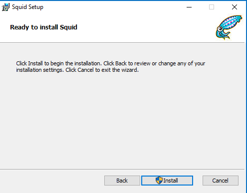
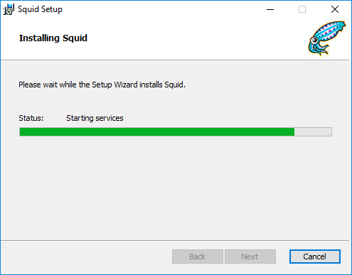
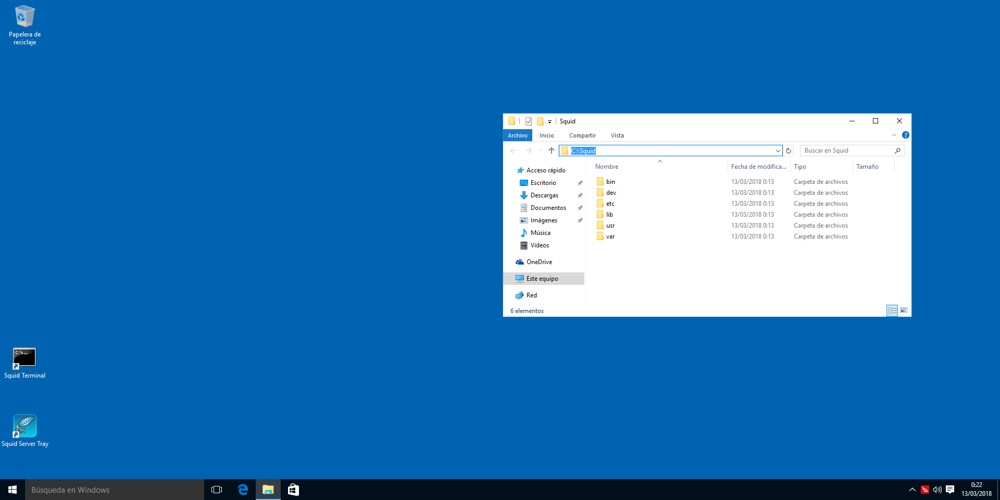
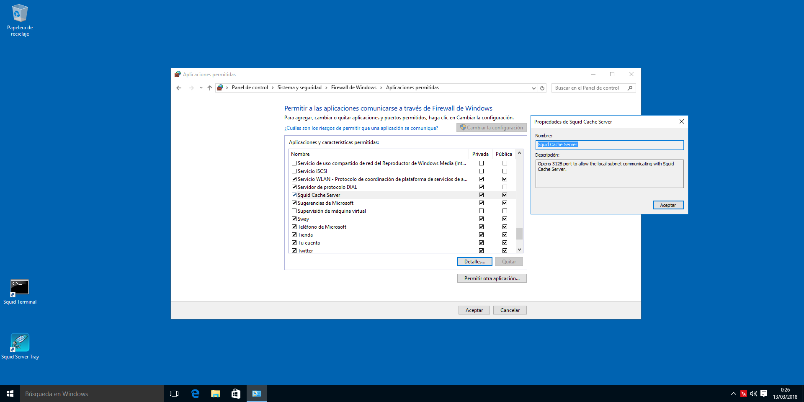
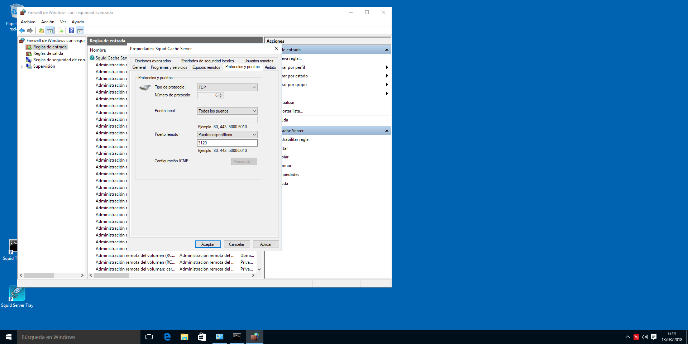

# Mastering Squid - Instalación

# Introducción

¡Bievenido al Mastering en Squid! Este es un curso extendido sobre cómo utilizar Squid dividido en varios posts para facilitar la lectura y ser más organizados. Advertimos que va a ser un curso bastante largo, y que puedana provecharlo al máximo. Disfruten del primer post, la instalación.


# ¿Qué es un proxy?

Es un software que permite facilitar la comunicación entre un cliente y un servidor sin modificar peticiones o respuestas. Cuando nosotros iniciamos una petición hacia una fuente para obtener algo, el proxy lo que hace es "secuestrar" esa conexión y representarse así mismo como un cliente de cara al servidor. Una vez devuelta la respuesta, esta llega al proxy y depende de sus políticas, esos datos quedan guardadados o se borran, y posteriormente se envía al cliente que solicitó los datos desde el principio.

Por lo tanto, actúa también como un potente filtro de peticiones basado en una serie de reglas que validen o no las peticiones que se vayan a realizar. Si por ejemplo, intentamos entrar a chachacha.com, y resulta que en la configuración del proxy se nos deniega el acceso, evidentemente, el proxy nos betará la conexión a dicha página con lo que se mejora la seguridad de la red mediante esta serie de políticas. También incrementa la defensa contra virus o malware ya que al analizar el tráfico puede ver si los sitios son o no de confianza.

Y no sólo por filtra el tráfico evitando que usuarios X accedan a sitios que no deben, o porque el proxy tiene una IP y la usaremos en vez de relevar la nuestra (en caso de ser remoto), también es útil, porque la información que solicitamos se almacena haciendo un "caching" permitiéndonos no tener que volver a descargar todo el contenido de una página Web, con lo que hace el acceso más rápido y reduciendo el consumo ancho de banda. Además, esto permite visualizar el tráfico que se está enviando y recibiendo, y si el consumo de ancho de banda es elevado, podemos darle un toque a los usuarios de que se están pasando de la ralla.

Y por último, si tenemos un servidor Web al que accede constantemente a CDNs para obtener documentos, imágenes, frameworks basados en JS, CSS3, HTML...etc, puede mantener todo almacenado y evitar incrementar el ancho de banda por petición, con lo que mejora el propio rendimiento del servidor web.

# ¿Qué es un proxy inverso?

Es una técnica que permite almacenar los archivos que se obtienen de CDN o de otros sitios remotos para almacenarlos en el servidor web local, con lo que, como hemos dicho anteriormente, aprovechar el ancho de banda para otros servicios de la red, gestionar bien el espacio de almacenamiento y evitar problemas de sobrecarga en el servidor.

Esta técnica es muy útil principalmente por el ahorro de ancho de banda, y como consecuencia, los clientes que se conecten al servidor web evitaran tener que enviar muchas peticiones a multitud de sitios (CDN mayormente) para obtener librerías JS, estilos CSS3...etc, ya que está almacenado en el proxy permitiendo reducir su gasto en datos móviles.

# Instalando Squid

En este apartado, encontraremos los pasos para poder instalar Squid en nuestra distribución, sistema. También incluimos los pasos de cómo compilar Squid en caso de que las características que busquemos no formen parte de los binarios pre-compilados.

## Fedora

Para instalar Squid en Fedora, tan solo tenemos que ejecutar:
```
$ su -c "dnf install squid"
```

## Archlinux
En esta fantástica distro:
```
$ sudo pacman -S squid
```
Que se encuentra en los repositorios "Community"

## Ubuntu/Debian 
Corremos en una terminal:
```
$ sudo apt-get install squid
```

## openSUSE
Tan sencillo cómo:
```
$ sudo zypper in squid
```

## CentOS / RHEL
```
$ sudo yum install squid
```

__NOTA: Si ya tienes instalado Squid, es mejor que te saltes el siguiente punto.__

## Compilando
En otras distribuciones que no mencionamos, siempre es mejor utilizar las fuentes oficiales, en caso de que no sea posible o que queramos tener ciertas caracterísiticas habilitadas, tendremos que compilar.

1. Descargar el archivo fuente
2. Instalar dependencias necesarias para compilar el paquete
3. Configurar las opciones de compilación
4. Compilar e instalar
5. Probar

Descargamos el tarball desde el siguiente [enlace](http://www.squid-cache.org/Versions/v3/3.5/squid-3.5.27.tar.gz), lo descomprimimos y nos situamos en el directorio mediante una terminal.

### Configurando las opciones de compilación
Aquí tenemos un listado enorme explicando un poco las opciones que podemos configurar en Squid:
```
--prefix=DIR
```
Como no, definimos el directorio dónde lo queremos instalar.
```
--enable-gnuregex
```
Esta característica permite habilitar las expresiones regulares cuando se construyen listas de control de acceso en Squid. En principio no hace falta habilitarlo, solo en aquellos sistemas que no soporten expresiones regulares.
```
--disable-inline
```
Cuando compilamos Squid por defecto, lo hace todo en línea y esto conlleva compilar todo el código. Sin embargo, si queremos que el proceso sea veloz pero para usarlo en un entorno de pruebas, podemos utilizar esta opción.
```
--disable-optimizations
```
Squid se compila por defecto con optimizaciones para generar un binario con mayor rendimiento. Esta opción al igual que la anterior es mejor dejarla solo para casos en desarrollo o pruebas.
```
--enable-storeio
```
Cuánto más rápido Squid pueda leer/escribir archivo desde caché, menos tardará en satisfacer una solicitud dando menos retrasos. Existen diferentes técnicas que permiten obtener un rendimiento más optimizado según el tipo de tráfico y el uso. Podemos construir Squid con varios tipos de módulos de almacenamiento de entrada/salida.

Podemos echarle un bitstazo a los módulos soportados ubicados en el directorio src/fs del código fuente de Squid.
```
--enable-removal-policies
```
Squid al estar almacenando páginas o documentos que se descargan cuando navegamos, es lógico que cada cierto tiempo tenga problemas con el espacio que hemos especificado y por lo tanto, necesitará más espacio. Squid decide que hacer con los archivos viejos si deberían eliminarse o limpiarlos para obtener más espacio y almacenar nuevos archivos. Hay diferentes políticas para limpiar los documentos almacenados en caché para obtener un mejor rendimiento.

Las políticas están basadas en heap (basadas en montículos, estructura de árbol de datos) y/o en listas de datos estructurados. Las listas de datos estructurados están habilitadas por defecto. Podemos comprobar en el código fuente src/repl/ las políticas disponibles.
```
--enable-icmp
```
La habilitamos sÓlo si utilizamos otras soluciones que almacenen datos en caché, ya que permiten determinar latencia entre ellas.
```
--enable-delay-pools
```
Permite limitar el ancho de banda de la red para que no se congestione. Es útil cuando tenemos un grupo de usuarios que efectúan multitud de operaciones sobre cuando descargan archivos que suelen saturar completamente el tráfico.
Squid hace uso de unos "_espacios de retardo_", filtra el tráfico y reduce la velocidad para que no se utilice todo el ancho de banda disponible.
```
--enable-esi
```
Permite a Squid utilizar _Edge Side_, un tipo de lenguaje de marrcas para definir los componentes de una página web para construirlos de forma dinámica y hacerlos llegar a las aplicaciones web en el borde de Internet. Si se habilita, Squid ignorará el control de almacenamiento por cabecera desde los clientes. Esta opción solo interesa si está en modo acelerador.
```
--enable-useragent-log
```
Permite registrar qué tipo de navegador está utilizando
```
--enable-referer-log
```
Squid podrá escribir un campo de encabezado de referencia en solicitudes HTTP
```
--disable-wccp
```
Esta opción deshabilita la compatibilidad con el protocolo (WCCP) de comunicaciones de servidores de almacenamiento en caché Web de Cisco. Permite la comunicación entre cachés y a su vez, ayuda a localizar el tráfico. Por defecto, está habilitada.
```
--disable-wccpv2
```
Deshabilita la versión 2 del protocolo anterior. Este es una versión mejorada que permite balanceo de carga, escalamiento, tolerancia a fallos, y un servicio con mecanismos de garantías. Por defecto está habilitado.
```
--disable-snmp
```
_Simple Network Management Protocol_ (SNMP) está habilitado por defecto y lo suelen utilizar los administradores de sistemas para monitorizar servidores o dispositivos de red como switches o routers.
```
--enable-cachemgr-hostname
```
El gestor de Caché (cachemgr.cgi) es una utilidad elaborada en CGI para gestionar la caché de Squid, también permite ver las estadísticas a través de un portal web. Por defecto podemos acceder al portal web mediante localhost o la IP de nuestro Squid.

```
--enable-arp-acl
```
Squid soporta la construcción de Listas de Control de Acceso por dirección MAC o Ethernet. Esta característica está deshabilitada por defecto. Si queremos controlar el acceso a los clientes basándonos en direcciones Ethernet, tenemos que habilitar esta características.

```
--disable-htcp
```
El protocolo HTCP (_Hypertext Caching Protocol_) puede utilizarlo Squid para enviar y recibir actualizaciones periódicas de software que almacene en caché. Esta opción deshabilita.

```
--enable-ssl
```
Squid pueden terminar con las conexiones SSL. Cuando se configura Squid en modo inverso, puede terminar con las conexiones SSL que hayan iniciado los clientes y manejarlas en nombre del servidor web en el back-end. Eso quiere decir, que el servidor Web en el backend como Apache con PHP, NGINX... no tiene que hacer trabajos de SSL, por lo que la conexión entre servidor web-Squid será en HTTP limpio, mientras que los clientes verán que acceden en modo seguro.
Solo es útil si está configurado en modo inverso o en modo acelerador.
```
--enable-cache-digests
```
Los resúmenes periódicos es la manera que tiene Squid para compartir información con otros servidores Squid acerca de los documentos web, en un formato comprimido.
```
--enable-default-err-language
```
Cuando no se puede acceder a una determinada página ya sea porque ha obtenido un error 404, o 503... Squid utiliza páginas predeterminadas para mostrar dichos errores en el idioma X. Por defecto son inglesas.
```
--enable-err-languages
```
Por defecto, Squid se compila con soporte a múltiples idiomas. Si solo queremos utilizar algunos, o uno en cuestión, podemos definirlo aquí.
```
--disable-http-violations
```
Deshabilitar las violaciones del protocolo HTTP, no permitir X los paquetes con la cabecera modificada se acepten por Squid.
```
--enable-linux-netfilter
```
Netfilter es un framework de filtrado de paquetes que apareció en los kernels 2.4.x y 2.6.x. Esta opción solo es útil si utilizamos un proxy transparente en sistemas Linux.
```
--enable-follow-x-forwarder-for
```
Cuando Squid envía una solicitud HTTP, Squid rellena con su IP el encabezado, sin embargo, añade información sobre el cliente para que se pueda encontrar si se usan más servidores proxy.
```
--disable-ident-lookups
```
Evita que Squid busque las identidades de los clientes, sin embargo, esto puede causar un DoS (_Denial Of Service_) si un cliente hace muchas peticiones largas de conexiones.
```
--disable-internal-dns
```
Deshabilitamos su propio sistema de Dirección de Resolución de Nombres, y utilizar DNS externos.
```
--enable-default-hostfile
```
Seleccionamos la ruta por defecto del fichero `/etc/hosts(5)`
```
--enable-auth
```
Provee de mecanismos de autenticación.

Sintaxis vieja

Habilitar sistemas de autenticación:
```
./configure --enable-auth=basic,digest,ntlm
```
Nueva sintaxis
La sintaxis que vamos a ver ahora es para seleccionar el esquema de autenticación que queremos utilizar. En este apartado hay programas de autenticación externos que nos pueden ayudar durante el proceso.
```
--enable-auth-basic
```
Habilita la compatibilidad con un esquema de autenticación básica y construye listas de software específicos necesarios en la compilación. Si la lista de software no se provee, habilitará por defecto todos los software. Hay una lista que contiene todos ellos en `helpers/basic_auth` Para deshabilitar esta opción: ```--disable-auth-basic```

Si no queremos habilitar esta opción, pero no queremos compilar ningún ayudante, utilizamos "none".

```
--enable-auth-ntlm
```
Squid soporta el esquema de autenticación llamado NTLM. Los ayudantes para este esquema específico reside en el directorio helpers/ntlm_auth Para deshabilitarlo: ```--disable-auth-ntlm```
```
--enable-auth-negotiate
```
Esta opción permite utilizar un esquema de negociación.
```
--enable-auth-digest
```
Permite utilizar el esquema de autenticación de resumen.
```
--enable-ntlm-fail-open
```
Permite a un ayudante fallar en el proceso de autenticación de un usuario. Es mejor que no utilicemos esta opción según la documentación.
```
--enable-external-acl-helpers
```
Permite utilizar listas de control de acceso externas. Las podemos encontrar aquí `helpers/external_acl`
```
--disable-translation
```
Deshabilita que se muestren páginas de error en el idioma local.
```
--disable-auto-locale
```
Se basa en la cabecera de peticiones en un cliente. Squid intenta de forma automática proveer de una página de error con el idioma local. Esto lo deshabilita.
```
--disable-unlinkd
```
Deshabilita el soporte unlinkd No es buena idea si se queda bloqueado el software.
```
--with-default-user
```
Squid corre por defecto como usuario nobody . Podemos seleccionar con que usuario correrlo.
```
--with-logdir
```
Squid almacena los logs en `/var/log/squid`, aquí podemos modificar la ruta de almacenado.
```
--with-pidfile
```
Modifica la ruta en la que se almacenará el .pid
```
--with-aufs-threads
```
Definimos el número de hilos que queremos que utilice el sistema de almacenamiento en caché llamado aufs. No se suele utilizar esta opción, Squid ya lo calcula.
```
--without-pthreads
```
Las versiones más viejas se compilan sin el soporte paralelo de POSIX. Por defecto las nuevas versiones se compilan con `pthreads` por defecto.

```
--with-openssl
```
Si queremos construir Squid con soporte OpenSSL, podemos utilizar esta opción:
```
--with-large-files
```
Squid registra todo y los ficheros de `/var/log/` especialmente los de acceso, crecen muy deprisa. Esto permite soportar los archivos pesados.
```
--with-filedescriptors
```
Los sistemas operativos utilizan descriptores de ficheros (números enteros) para seguirle la pista a los ficheros y sockets que estén abiertos. Por defecto, el límite en las conexiones normalmente es 2014. Una vez que Squid tiene conexiones aceptadas que tienen consumido todos los ficheros descriptores disponibles para el usuario Squid, no puede aceptar más conexiones si no cuando se liberen más ficheros descriptores.

Para saber qué límite tenemos:
```
ulimit -n
```
Para añadir más, hay que añadir las siguientes líneas:
`/etc/security/limits.conf(5)`
```
username hard nofile 8192
username soft nofile 8192
```

### Aplicando opciones de configuración
Una vez que tengamos nuestra lista de características, procedemos a aplicarlas en la fase de pre-compilado.
```
./configure --prefix=/usr --disable-wccp --disable-wccpv2 --disable-snmp --enable-arp-acl --disable-htcp --enable-ssl --enable-cache-digests --enable-default-err-language=Spanish --enable-linux-netfliter --disable-ident-lookups --disable-internal-dns --enable-default-hostsfile --with-default-user=squid --with-openssl --with-large-files
```

### Compilamos e instalamos
Básicamente efectuaremos la compilación de `squid(8)`

__NOTA: Podemos hacer uso de los hilos para que la compilación vaya más rápida `make -jN` dónde N, va el número total de núcleos + hilos, ejemplo 2 núclos, 4 hilos = make -j6__
```
$ make && sudo make install clean
```

Y ya lo tendremos instalado en nuestro sistema.

### Crear el servicio 
Creamos un nuevo archivo en `/etc/systemd/system/squid.service` con el siguiente contenido:
```
[Unit]
Description=Squid
After=network.target

[Service]
ExecStartPre=/usr/libexec/squid/cache_swap.sh
ExecStart=/usr/sbin/squid -f /etc/squid/squid.conf
ExecReload=/usr/sbin/squid -k reconfigure -f /etc/squid/squid.conf
ExecStop=/usr/sbin/squid -k shutdown -f /etc/squid/squid.conf
```

__NOTA: Sustituimos los directorios `/usr...` por aquel dónde se instaló.__

### Gestionando el servicio
Iniciar el servicio temporalmente:
```
$ sudo systemctl start squid.service
```

Parar el servicio momentáneamente:
```
$ sudo systemctl start squid.service
```

Reiniciar Squid:
```
$ sudo systemctl restart squid.service
```

Habilitar Squid al inicio:
```
$ sudo systemctl enable squid.service
```
Deshabilitar el servicio:
```
$ sudo systemctl disable squid.service
```

### Gestionando el firewall con FW

Para permitir las conexiones al proxy de forma temporal en `firewalld(1)` bastará con ejecutar:
```
$ sudo firewall-cmd --add-port 3128/tcp --zone=public
```

Permitir conexiones de forma permanente:
```
$ sudo firewall-cmd --add-port 3128/tcp --zone=public --permanent
```

Para eliminar la apertura del puerto de forma temporal
```
$ sudo firewall-cmd --remove-port 3128/tcp --zone=public
```

Eliminarlo de forma permanente
```
$ sudo firewall-cmd --remove-port 3128/tcp --zone=public --permanent
```

Eso es todo

## Windows
Existe una versión portada para Windows elaborada por un tercero, una empresa llamada Diladele BV, ubicada en Amsterdam. Se puede obtener desde [aquí](http://packages.diladele.com/squid/3.5.27/squid.msi).
__NOTA: Si encontramos algún fallo en el instalador, podemos reportarlo a través de este [git](https://github.com/diladele/squid-windows/issues?target=_blank)__

### Instalando
Una vez descargado, lo instalamos y seguimos los pasos a continuación.

[owl-carousel items=1 margin=10 loop=true autoplay=true autoplayHoverPause=true nav=true]





[/owl-carousel]

### Configuración, puertos y más

Podemos ver en el escritorio cómo se nos han creado 2 iconos de escritorio relacionados con Squid. "Squid Console" y "Squid Server Tray", el primero nos permite interactuar con el servidor a través de una `cmd.exe` y el segundo, nos permite arrancar el servidor en modo silencioso, es decir, minimizado en el área de notificación o bandeja del sistema.

Si hacemos clic derecho en el icono de Squid en la bandeja del sistema, tendremos una serie de opciones como:
 * Editar el fichero de configuración
 * Ver la carpeta de Squid
 * Iniciar el servicio
 * Parar el servicio
 * Acerca de
 * Salir

[owl-carousel items=1 margin=10 loop=true autoplay=true autoplayHoverPause=true nav=true]



[/owl-carousel]

Tenemos que revisar que Squid arranca como servicio en Windows, para ello hay que ejecutar el programa `services.msc` y mirar las propiedades de "Squid" tal y como se muestra en la siguiente imagen:


Por defecto Squid utiliza el puerto 3128, por ende, tenemos que habilitarlo en el firewall de Windows "Inicio-> En el buscador escribimos-> Firewall Windows".


Si queremos modificar el puerto por defecto, tendremos que editar el fichero de configuración de Squid que se encuentra en `C:\Squid\etc\squid.conf`, en la directiva 
```
Port 3128
```
Cambiarla por el puerto que queramos, y posteriormente, tenemos que dirigirnos a "Inicio -> Buscar Configuración avanzada del FW Windows -> Reglas de entrada -> Modificar Squid Cache Server" y poner el puerto que queramos, tal y como se ve en la imagen.



Posteriormente, reiniciamos el servidor Squid desde la bandeja del sistema y ya tendremos Squid funcionando con el nuevo puerto que le hemos asignado.

# Referencias
 * Google
 * Squid-cache ~ [Página oficial](http://squid-cache.org?target=_blank)
 * [Diladele](http://squid.diladele.com?target=_blank)
 * Wikipedia ~ [Proxy](https://es.wikipedia.org/wiki/Servidor_proxy?target=_blank)
 * Squid Server Proxy 3.1 ~ Book