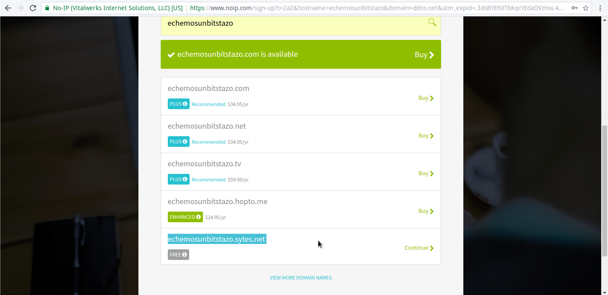
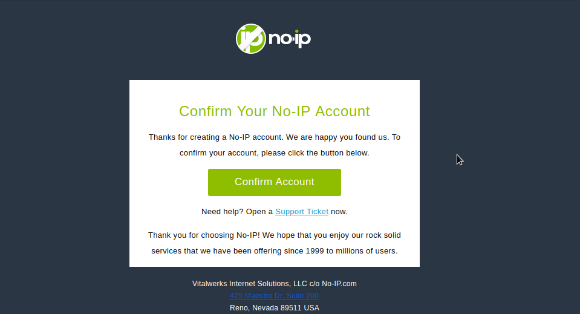
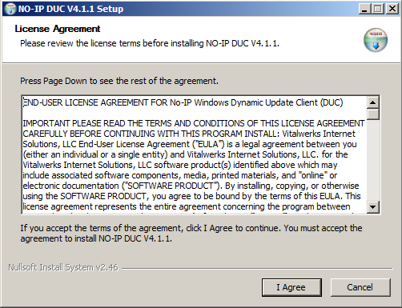
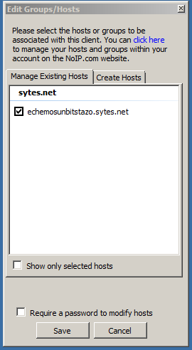

# No-IP - ¿Cómo obtener un acceso fijo a un servidor?

# Introducción

Seguramente alguna que otra vez nos ha interesado montar un servidor casero ya sea para alojar contenido Web, enviar e-mails... o tener un gestor de descargas al que conectarnos a nuestra casa, dejar descargando cosa X y que al llegar esté listo para alojarlo en una unidad USB para un uso Y.

Sin embargo, si nos damos cuenta, cada vez que reiniciamos el router, obtener otra IP diferente y se nos va todo al garete. Tenemos que volver a obtener la dirección de nuestra IP pública a través de un servicio como [What's my IP?](https://www.whatsmyip.org?target=_blank),[ipify](https://www.ipify.org?target=_blank)... esto es debido a que el ISP (_Proveedores de Servicio de Internet_) como Movistar otorga nuevas direcciones IP cuando detectan que se conecta un dispositivo a su pool de direcciones, machacando la vieja IP y obteniendo una nueva. Sin embargo, hay ISP como ONO (_ahora Vodafone_) que otorgan una IP fija y evita hacer uso de este post.

__NOTA: Se puede solicitar una IP estática pública, pero los precios para ello son muy elevados y muchas veces no compensa dependiendo de la actividad que vayamos a realizar.__

# ¿Cómo acabar con el problema?
Existen muchos servicios en Internet que pueden darnos una IP fija como [Dyn](https://dyn.com?target=_blank) (_antes DynDNS_), no obstante, vamos a utilizar los servicios de No-IP.org. Este servicio te proporciona un subdominio a elección, y un dominio ya existente, con lo que, realmente accederás al dominio y no a una IP X con lo que *será mucho más fácil acordarnos*.

Una vez que nos registremos y tengamos instalado el servicio, este preguntará cada cierto tiempo la IP pública, y si es nueva la irá renovando junto con los servidores de No-IP para qué cada vez que queramos acceder esté operativo aunque haya cambiado más de 100 veces de IP.

# Registro
Primero accedemos a la página mediante el siguiente [enlace](https://www.noip.com?target=_blank), y nos registramos escogiendo un subdominio y un dominio ya existente.

[owl-carousel items=1 margin=10 loop=true autoplay=true autoplayHoverPause=true nav=true]






[/owl-carousel]

Nos enviarán un correo de confirmación, por lo que sería conveniente que revisemos las bandejas de Spam o "correo no deseado" en caso de que no nos aparezca en la bandeja de entrada _normalmente suele tardar milésimas de segundos_.

# Instalando el servicio
Nos descargamos el servicio de No-IP desde [aquí](https://www.noip.com/download?target=_blank) para el sistema operativo que tengamos, vale FreeBSD, Linux, Windows, OS X...

## Linux
En este apartado veremos como se instala, configura y ejecuta el servicio:

### Fedora
Para instalarlo en Fedora, solo hay que ejecutar:
```
$ su -c "dnf install noip"
```
Y se instalará, este servicio se encuentra en los repositorios oficiales por lo que no necesitaremos añadir ningún repositorio adicional y cuenta con el respaldo de la comunidad directamente.

### Código fuente
Parece que Fedora es la única distribución dentro de las más populares que mantiene noip de forma comunitaria y oficial. En este apartado explicaremos como instalarlo mediante código fuente para el resto de distribuciones.

```
$ wget http://www.no-ip.com/client/linux/noip-duc-linux.tar.gz
$ tar xfv noip-duc-linux.tar.gz
$ cd noip-2.1.9-1
```

Por defecto, si lo compilamos y lo instalamos se instalará en el directorio `/usr/local`, para configurar un directorio diferente, hay que redefinir el `PREFIX=` que se incluye dentro del fichero `Makefile`. Por ejemplo:

```
TGT=noip2
CC=gcc
PKG=noip-2.1.tgz

PREFIX=/opt/noip
CONFDIR=${PREFIX}/etc
BINDIR=${PREFIX}/bin

# these defines are for Linux
LIBS=
ARCH=linux

[Texto cortado]
```

Se instalará en el directorio `/opt/noip`, recordemos que si configuramos un directorio ajeno a `/usr; /usr/local` hay que añadir a la variable `PATH` de nuestro `.bash_profile` o `/etc/profile.d/noip.sh`

```
/etc/profile.d/noip.sh

#!/bin/bash
PATH=$PATH:/opt/noip/bin
export PATH
```

Ejecutamos:
```
$ sudo make install
```
Se instará en el directorio `/opt/noip` siguiendo el ejemplo de arriba, y nos saltará una salida interactiva como esta:
```
if [ ! -d /opt/noip/bin ]; then mkdir -p /opt/noip/bin;fi
if [ ! -d /opt/noip/etc ]; then mkdir -p /opt/noip/etc;fi
cp noip2 /opt/noip/bin/noip2
/opt/noip/bin/noip2 -C -c /tmp/no-ip2.conf

Auto configuration for Linux client of no-ip.com.

Multiple network devices have been detected.

Please select the Internet interface from this list.

By typing the number associated with it.
0	wlo1
1	vboxnet0
```

Nos está pidiendo qué interfaz es la que se encuentra conectada a Interner y cuál utilizaremos (_en caso de tener más de una NIC_), seleccionamos wlo1 (_en mi caso._).
```
Please enter the login/email string for no-ip.com  [INSERTA AQUÍ EL E-MAIL CON EL QUE TE REGISTRASTE]
Please enter the password for user [TU_EMAIL] [INSERTA LA CONTRASEÑA]

Only one host [echemosunbitstazo.sytes.net] is registered to this account.
It will be used.
Please enter an update interval:[30]  [EN MINUTOS]
Do you wish to run something at successful update?[N] (y/N)  [PODEMOS DECIR QUE SÍ PARA QUE EJECUTE UN SCRIPT CADA VEZ QUE LA OPERACIÓN SALGA BIEN]
Please enter the script/program name  [SI HAS ESCOGIDO QUE SI EN LA PREGUNTA ANTERIOR, INTRODUCE LA RUTA, SI NO IGNORA EL MENSAJE]
New configuration file '/tmp/no-ip2.conf' created.

mv /tmp/no-ip2.conf /opt/noip/etc/no-ip2.conf

```

Perfecto, ya lo tenemos configurado.

# Trabajando con No-IP en Linux

Para ejecutar el servicio siguiendo el ejemplo anterior basta con:
```
/opt/noip/bin/noip2
```

Y ya estrá trabajando:
```
$ ps aux |grep noip2
nobody   10219  0.0  0.0  23220  2008 ?        Ss   16:32   0:00 /opt/noip/bin/noip2
```

Mostrando la configuración actual:
```
/opt/noip/bin/noip2 -S
```

Obtendremos una salida como esta:
```
1 noip2 process active.

Process 10219, started as noip2, (version 2.1.9)
Using configuration from /opt/noip/etc/no-ip2.conf
Last IP Address set [TU_IP_PÚBLICA]
Account [TU@EMAIL.COM]
configured for:
	host  echemosunbitstazo.sytes.net [TU_DIRECCIÓN_REGISTRADA]
Executing /opt/noip/success.sh upon successful update. [SCRIPT_QUE_CONFIGURASTE_SI_NO_LO_HICISTE_OBVIALO]
Updating every 30 minutes via /dev/wlo1 with NAT enabled. [NOTIFICA QUE HAY NAT EN TU CONEXIÓN, Y USA LA NIC QUE CONFIGURASTE]

```

Prueba rápida de conexión si no tenemos el bloqueo de respuestas ICMP en nuestro firewall habilitado:
```
PING echemosunbitstazo.sytes.net (TU_IP_PUBLICA) 56(84) bytes of data.
64 bytes from A.red-B.dynamicip.rima-tde.net (TU_IP_PUBLICA): icmp_seq=1 ttl=64 time=4.73 ms
64 bytes from A.red-B.dynamicip.rima-tde.net (TU_IP_PUBLICA): icmp_seq=2 ttl=64 time=5.04 ms
64 bytes from A.red-B.dynamicip.rima-tde.net (TU_IP_PUBLICA): icmp_seq=3 ttl=64 time=4.89 ms
--- echemosunbitstazo.sytes.net ping statistics ---
4 packets transmitted, 4 received, 0% packet loss, time 3002ms
rtt min/avg/max/mdev = 4.733/5.069/5.609/0.333 ms

```

Si tenemos un servidor SSH, nos conectamos:
```
ssh USUARIO@TU_URL_REGISTRADA.XXX
```

__NOTA: Puede que este proceso lleve pasos adicionales en el router, como redireccionamiento de puertos o la apertura de los mismos. Como recomendación, si tenemos un router con acceso SSH y web, lo mejor es modificar el puerto de los servicios o bien hacer un redireccionamiento de los puertos en el router.__

# Creando entrada en el gestor de servicios
En este apartado, te explicaremos cómo añadir No-IP al gestor de servicios `systemd(1)`

Creamos un archivo en `/etc/systemd/system/noip2.service` y añadimos las siguientes líneas siguiendo el ejemplo anterior. Si lo hemos instalado con el `PREFIX` por defecto lo adaptamos.

```
[Unit]
Description=No-IP2 service
Requires=network.target

[Service]
ExecStart=/opt/noip/bin/noip2 -c /opt/noip/etc/no-ip2.conf

[Install]
WantedBy=network.target
```

Para ejecutarlo:
```
$ sudo systemctl start noip2.service
```

Para pararlo:
```
$ sudo systemctl stop noip2.service
```

Para habilitarlo cuando inicie el sistema
```
$ sudo systemctl enable noip2.service
```

Para deshabilitarlo cuando arranque el sistema:
```
$ sudo systemctl disable noip2.service
```


# Windows
En Windows deberás descargarte el cliente desde el siguiente [enlace](https://www.noip.com/download?page=win?target=_blank) y proceder a su instalación.

Una vez instalado, se nos abrirá el cliente pidiéndonos el login, una vez pasada esta ventana, simplemente añadimos la máquina y ya tenemos el servicio corriendo.

[owl-carousel items=1 margin=10 loop=true autoplay=true autoplayHoverPause=true nav=true]





[/owl-carousel]

# Recursos
No-IP.org ~ Página documentada
noip.tar.gz ~ LEEME, instrucciones de instalación