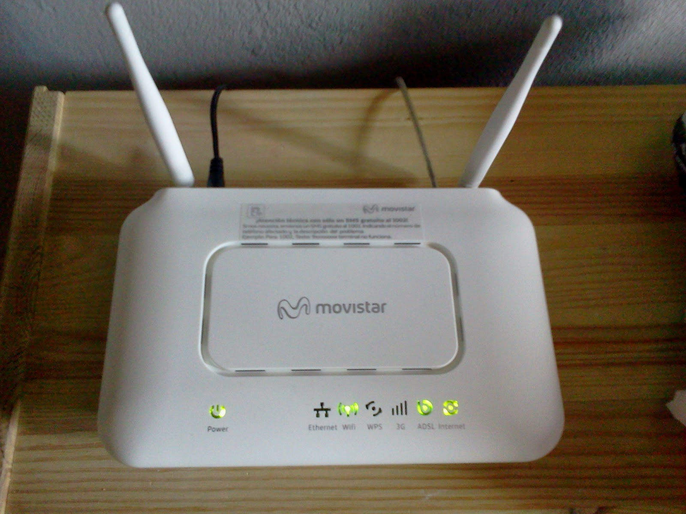
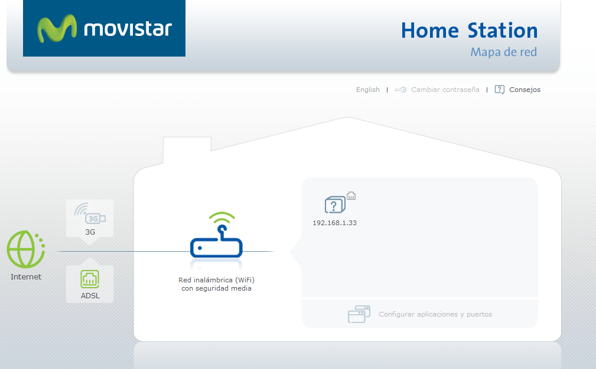
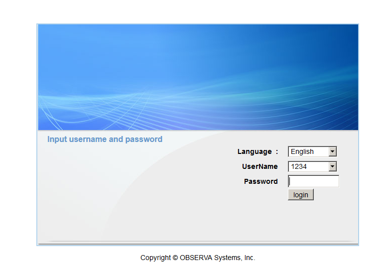
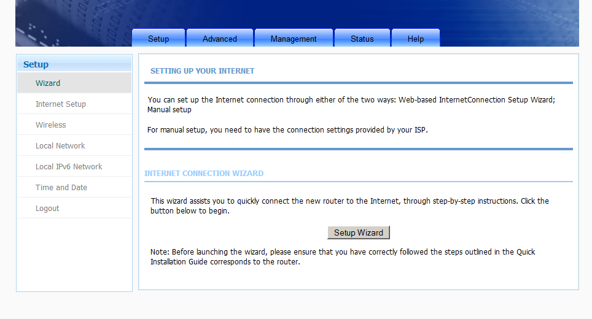
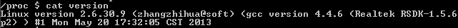

# Configuración Router BHS-RTA, Home Station

# Introducción



Hemos rescatado este artículo de nuestro viejo blog publicado el 19 de marzo del 2014, debido al alto tráfico que recibía. En este artículo vamos a ver cómo acceder a la interfaz Web original del router que vamos a comentar y saltarnos la interfaz que nos impone Movistar en este modelo de router.

Como podemos ver en la imagen, podemos ver cómo es el portal Web impuesto por Movistar, y en la segunda, ver la interfaz original del router.

[owl-carousel items=1 margin=10 loop=true autoplay=true autoplayHoverPause=true nav=true]



[/owl-carousel]

Para llegar hasta ahí, hemos tenido que ir mirando cómo encontrar el portal Web, ya que tiene una redirección del puerto 80 hacia Movistar, entonces, ¿Cómo accedemos a la interfaz Web del router? Pues mediante otro puerto. Hemos descubierto, que corre bajo el puerto 8000 después de conectarnos via Telnet como os explicaremos más abajo.
Pero antes de acceder, tendremos que averiguar ¿Qué IP tiene nuestro router?

# ¿Cómo identificar la IP de nuestro router?

Bastará con identificar la puerta de enlace a través de un intérprete de comandos como `bash(1)`, `sh(1)`, `cmd.exe`... 

Para los que no lo sepan, la puerta de enlace es el dispositivo que tenemos en una red que intercomunica con redes distintas. Es decir, cuando un dispositivo está dentro de un segmento de red y quiere enviar información, lo que hace es enviar un paquete ARP (_Address Resolution Protocol_ o protocolo de resolución de direcciones) que permite determinar las IPs y MAC de los equipos que hay dentro del segmento de red. Cuando nosotros enviamos un paquete a un dispositivo que no se encuentra dentro de la red, se envía a la puerta de enlace y este dispositivo, que es generalmente un router (_ya que hay switches que trabajan en L3_), se encarga de gestionarlo para que el otro dispositivo de la red X pueda recibirlo de la forma más rápida o estable posible, esto recibe el nombre de enrutar.

Una explicación sencilla, estamos en la sala de espera de un hospital (_segmento de red_) y hay un(a) informador(a). El trabajo de esta persona, es coger la información de los médicos que se encuentran en sus consultas (_varios segmentos de red_), para, posteriormente, notificar lo que tiene x paciente a sus familiares, pareja, amig@s... que están en la sala de espera. 

Para poder identificar el "_gateway_" basta con abrir una consola y ejecutar una serie de comandos.

## Linux
En cualquier distribución, abrimos un intérprete de comandos y ejecutamos:
```
$ ip route
```
Este comando permite visualizar las rutas que hay configuradas, sean dinámicas o estáticas. 

_Nota: Las rutas son caminos por dónde pasarán los paquetes y pueden ser estáticos o dinámicos. Los explicaremos en otros posts, cuando estén elaborados los enlazaremos directamente._

Salida similar:
```
default via 192.168.1.1 dev wlo1 proto static metric 600 
192.168.1.0/24 dev wlo1 proto kernel scope link src 192.168.1.51 metric 600 
```

 * Nos dice que la puerta de enlace es la: `192.168.1.1`, es decir, que todos los paquetes ajenos a la red 192.168.1.0/24 pasarán por la interfaz `wlo1` con dicha IP.
 * `192.168.1.51` es nuestra IP en este segmento de red.

## Windows
Hay múltiples formas de acceder al `cmd.exe`

 * XP: _Inicio -> Ejecutar..._
 * 7: _Inicio -> Cuadro de texto "Buscar programas y archivos" -> Escribimos cmd.exe
 * 8: _Tecla Inicio -> cmd.exe_
 * 10: _Cuadro de búsqueda del escritorio_ -> Escribimos cmd.exe

Ejecutamos:
```
> ipconfig
```

Salida como esta:
```
Microsoft Windows [Versión 6.1.7601]

Copyright (c) 2009 Microsoft Corporation. Reservados todos los derechos.

C:\Users\sincorchetes>ipconfig

Configuración IP de Windows

Adaptador de Ethernet Conexión de área local:

   Dirección IPv4. . . . . . . . . . . . . . : 192.168.1.21

   Máscara de subred . . . . . . . . . . . . : 255.255.255.0

   Puerta de enlace predeterminada . . . . . : 192.168.1.1
```

Ya tenemos identificada la puerta de enlace.

# ¿Cómo conectarnos al router?

Básicamente, se accede mediante via `telnet(1)`, si, resulta muy conmovedor que se utilice uno de los protocolos más inseguros para conexiones remotas en los routers de Movistar y no OpenSSH (_Open Secure SHell_) que es el protocolo utilizado hoy en día para esto. Tenemos que tener `telnet(1)` en nuestro sistema, si no lo tenemos, podemos echarle un _bitstazo_ al post anterior "[Instalando Telnet en nuestro sistema]"(https://echemosunbitstazo.es/blog/instalar-telnet?target=_blank).

Por ejemplo, utilizando el ejemplo anterior:
```$ telnet 192.168.1.1```

Y ya estaríamos dentro del router, para saber qué versión del sistema está utilizando, basta con ejecutar:
```
$ cat /proc/version
```

Os saldrá algo tal que así:



Para ver los puertos que tenemos abiertos en él, basta con hacer:
```
$ cat /var/webport 
```

Para ver los puertos que hay abiertos en el router, a nosotros nos salio una salida como esta:
```
ipv6:80
ipv6:8000
ipv6:443
ipv6:7547
```

Ambos puertos pueden accederse utilizando la dirección IPv4 que tiene el router, es curioso que no lo liste por ipv4 o tenga ipv4, ipv6.

 * 80 --> Es un puerto que entra dentro de los puertos bien conocidos reservados para servicios y aplicaciones (van del 0-1023) y su uso queda reservado para el protocolo de intercambio de HyperTexto (HTTP), es decir, servidores Web. 
 * 8000 --> Se encuentra dentro de los llamados _puertos registrados_ con un rango que van desde el puerto número 1024-49151, estos puertos se asignan a procesos o aplicaciones de usuarios. Éste en concreto según la lista de puertos registrados se hace uso para iRDMI, pero se ve que aquí lo utilizan de forma errónea para utilizarlo como un 80, si fuese un puerto alternativo, debería ser 8080 que es como debe ser usado.
 * 443 --> Es un puerto como el8 80, entra dentro de los puertos bien conocidos y su uso es para conexiones cifradas mediante certificado SSL a través del protocolo HTTP
 * 7547 --> Es un estándar aplicado por la DSL Forum en un documento llamado TR-069, se utiliza para gestionar de forma remota la configuración y administración del router. Por lo general, los técnicos _Helpdesk_ que te ayudan a solucionar los problemas de averías, hacen uso de este puerto para acceder a tu dispositivo.

# Referencias
* Google 
* CCNA - Listado de puertos (.pdf)
* TR-069 - [Wikipedia](https://es.wikipedia.org/wiki/TR-069?target=_blank)
* TR-069 - [Oficial](https://www.broadband-forum.org/standards-and-software/technical-specifications/tr-069-files-tools?target=_blank)