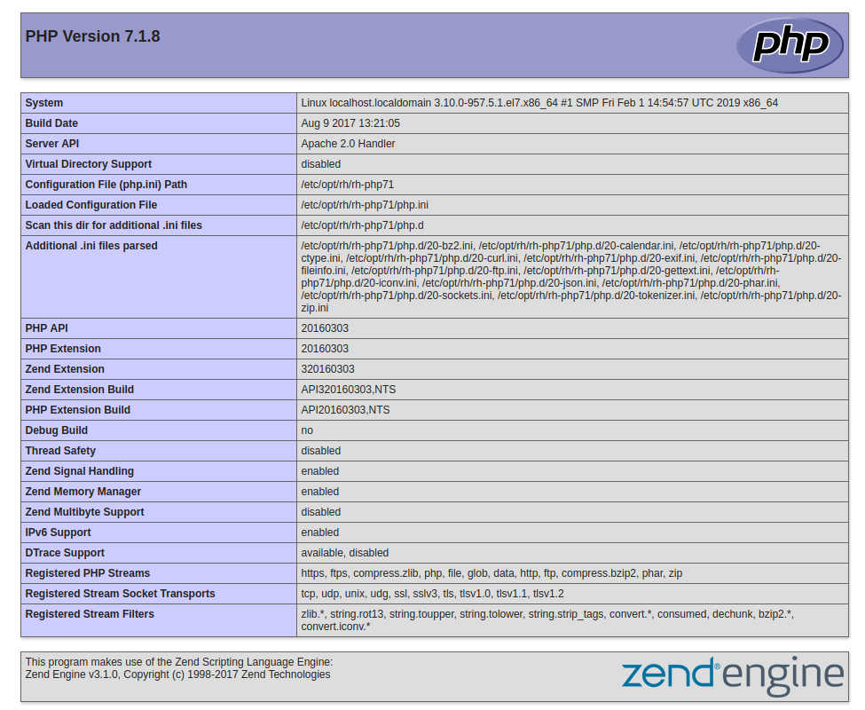

Bienvenido a mi primera entrega de PHP, en esta entrega podrás conocer los conceptos básicos para saber qué es PHP y cómo trabaja. También verás ejemplos de un código PHP programado para una Web y también ejecutado directamente en una consola PHP en tu sistema operativo. 

Una vez que acabes de leer esta entrada podrás:
 
 * [Sabrás que es PHP](#que-es-php)
 * [¿Cómo funciona?](#como-funciona)
 * [Ejecutar código PHP en un cliente de terminal](#programar-terminal)
 * [Ejecutar código PHP en un servidor Web a través de páginas `*.php`](#programar-web)
 * [Conocer dónde se encuentran ubicados los ficheros de configuración](#referencias)

# ¿Qué es PHP? <a id="que-es-php"></a>
PHP viene de las siglas un tanto recursivas en inglés PHP: _Hypertext Preprocessor_.Es uno de los lenguajes de programación de código abierto más populares que existen en el desarrollo de páginas Web cuyo contenido sea dinámico como puede ser un blog como es el caso de Wordpress; una herramienta de administración de monitorización como puede ser Nconf... por lo que los desarrolladores lo conocerán como un lenguaje que se ejecuta en el lado del servidor y no en el lado del cliente como es el caso de Javascript.

Además de poder trabajar con él generando páginas Web cuyo contenido sea dinámico, también se pueden crear scripts y rutinas conjuntamente con el sistema operativo, ya que posee una consola con la que poder interactuar con él. 

Esto permite a PHP ser un lenguaje versátil con el que puedes programar procesos o rutinas que se ejecuten en el sistema mediante metodología de scripting, o bien, programar procesos que trabajen con un servidor Web, un sistema gestor de base de datos... que puedan generar contenido dinámico.

# ¿Cómo funciona? <a id="como-funciona"></a>

A nivel de sistema operativo, cuando tienes una consola, los comandos que se ejecuten en ella, directamente se ejecutará y devolverá un resultado. Esto es válido también para el desarrollo de scripts junto con el sistema operativo. Se pueden crear rutinas y ejecutar código bash a través de una shell de PHP.

Sin embargo, también se puede ejecutar código PHP y que inserte el resultado en una página web con contenido HTML siempre y cuando su extensión sea `.php`. Además, se puede controlar qué código HTML dependiendo de un resultado como por ejemplo,  que quieres que se muestre si estás logueado o no, o si incorporas un sistema con mecanismos de control.

Aquí tienes una explicación simple del funcionamiento de un servidor Web con PHP.


# Programando con PHP en terminal <a id="programar-terminal"></a>
Para abrir una terminal y empezar a trabajar con PHP directamente hay que ejecutar:
```
php -a
Interactive shell

php >
```
Verás que el prompt del sistema a cambiado a `php > `

Se puede ejecutar el código desde un fichero:

```
Contenido del archivo ejemplo.php
$foo = "Hello world";
echo $foo;

Ejecutamos:
php -f ejemplo.php
Hello world $
```
 * **NOTA**: _No necesariamente hay que utilizar la extensión `.php` para que ejecute el código PHP que haya dentro de un archivo._

# Trabajando con PHP con un servidor Web <a id="programar-web"></a>

Para trabajar con un servidor Web como NGINX, Apache, Lighthttpd, Cherokee... habrá que respetar la extensión `.php` en tus archivos. y añadir una etiqueta de [apertura](http://php.net/manual/es/language.basic-syntax.phptags.php?target=_blank) para que el servidor interpete el código PHP como código PHP y no código HTML.

Por ejemplo:

/var/www/html/index.php en un servidor X existe el siguiente código:

```
<?php
 
	echo "Hello World!" # Contenido de ejemplo que muestra la frase Hello world
?> 
```

Si el servidor Web y el PHP están correctamente instalados, devolverá el siguiente mensaje:
```
Hello world!
```

Automáticamente, se traduce en HTML como un párrafo `<p>Hello world!</p>`

Se puede mezclar código HTML y PHP siempre y cuando tenga la extensión `.php` tu archivo:

En /var/www/html/foo.php de un servidor Y:

```
<!DOCTYPE html>
<html>
	<head>
<title><?php echo$titulo; ?> </title>

<meta charset=”utf-8”>

</head>

<body>

<?php $titulo = “Esto es untitulo”; ?>


<?php $texto= “Esto es unalínea de código”; ?>

<p><?php echo $texto;?></p>

</body>
</html> 
```

Esto va a generar una página con el siguiente resultado, que será interpretado por el navegador como dos párrafos:
```
<p>Esto es un título</p>
<p>Esto es una línea de código</p>
```

Si queremos saber toda la información que tiene la versión que tienes instalada de PHP bastará con:
````
<?php

	phpinfo():

?>
````



En la siguiente entrega te encontrarás con:
 * ¿Cómo instalar PHP?
 * ¿Cómo configurarlo?

# Referencias <a id="referencias"></a>
 * [PHP manual online](http://php.org?target?_blank)
 * Google
 * Wikipedia