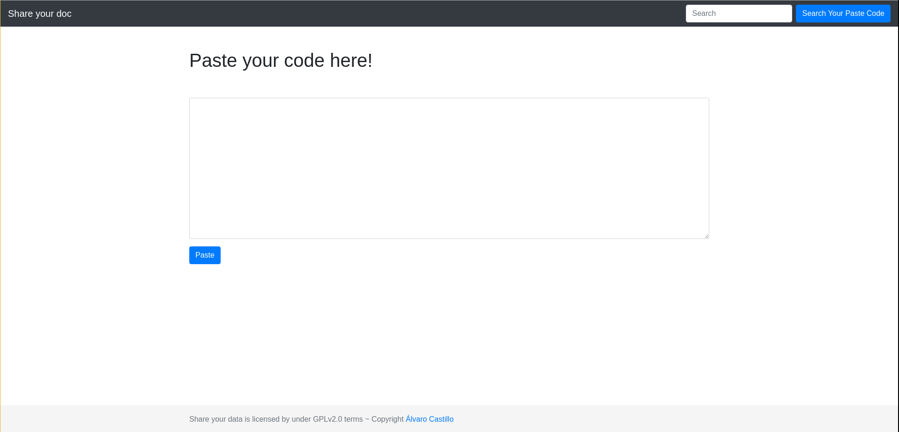

# Share Your Doc una versión minimalista de Pastebin
Hace unos días acabé una pequeña herramienta Web llamada Share Your Doc, que permite compartir código fuente, mensajes, scripts...etc via Web como si fuese un típico servicio de [Pastebin](http://pastebin.com?target=blank), [Fpaste](http://fpaste.org) como seguramente conocerás. 

Sin embargo, lo bueno que tiene este, es que trabaja conjuntamente con el sistema operativo, no requiere de ningún método para validarse de usuarios, ni tampoco hace uso de conexiones FTP. Simplemente, añades tu código, creas el token y a correr.



Es una herramienta pensada para trabajos de grupo con desarrolladores, administradores de sistemas... aunque puedes darle el uso que quieras. Lo único que necesitas para tenerla instalada, es tener PHP, un servidor Apache, y si acaso, tocar algún que otro permiso en Linux.

Para obtenerla solo te tendrás que clonar el repositorio alojado tanto en Github como en Gitlab.

```
git clone https://gitlab.com/sincorchetes/shareyourdoc.git
git clone https://github.com/sincorchetes/shareyourdoc.git
```

O si deseas, también puedes descargar el SRC desde la página del repositorio.

NOTA: Si usas SELinux, asegúrate de tener etiquetados todos los archivos bajo: `unconfined_u:object_r:httpd_sys_content_t:s0`

¡Espero que os guste, saludos!