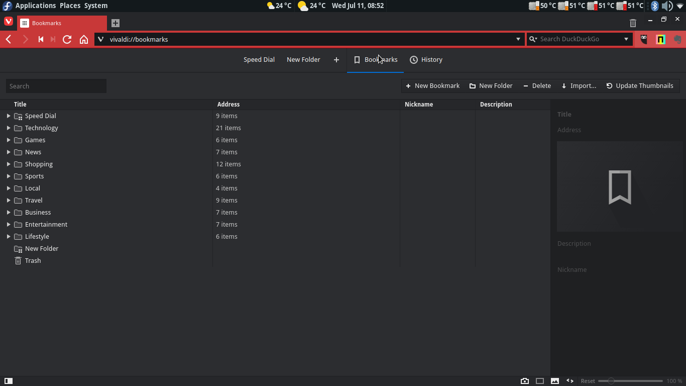

Vivaldi es un navegador gratuito desarrollado por la empresa Vivaldi Technologies, cuya compañía fue fundada por el cofundador y ex-CEO de Opera Jon Stephenson von Tetzchner, y Tatsuki Tomita quiénes quedaron bastante descontentos por varias decisiones que tomó la empresa Opera Software hace bastante tiempo como el cierre del portal comunitario My Opera y dejando atrás las opiniones de las personas que ayudaban a su desarrollo y mejora.

# ¿Qué nos aporta Vivaldi?
Vivaldi es muy poco conocido pero que daría mucho del qué hablar. Tiene una apariencia parecida a Opera y contiene multitud de características y ventajas por doquier.

[owl-carousel items=1 margin=1 loop=true autoplay=true autoplayHoverPause=true nav=true]

[/owl-carousel]

## Disponible para varios sistemas operativos
Actualmente dispone de paquete estables x86/x86_64 tanto para sistemas que usen paquetería .deb como .rpm. También hay un paquete considerado inestable enfocado a ARM 32 y solo disponible en formato .deb.
Por otro lado soporta Windows y Mac.

## Memoria RAM
Vivaldi es capaz de consumir una cuarta parte de lo que consumiría Google Chrome o Firefox a pesar de tener multitud de pestañas abiertas, con lo que podemos navegar de una forma fluida y trabajar con nuestro equipo sin tener que estar prescindiendo de determinados programas, páginas con contenido interactivo...etc

## Soporte extensiones de Chrome
Si no puedes vivir sin las extensiones de Google Chrome con Vivaldi **podrás tenerlas sin ningún problema y sin tener que instalar complementos o extensiones adicionales**. Con tan solo acceder a la página _Chrome Store_ podrás instalar cualquier extensión sin problemas.

## Motor de renderizado Blink
Utiliza Blink para interpretar todos los elementos del diseño y el contenido Web a una **velocidad de vértigo**. Por defecto es el motor de renderizado que utiliza Google Chrome y Opera Software.

## Sencillo y potente
Se pueden utilizar gestos para abrir páginas Web, pestañas, cerrarlas y **configurar tus propios gestos para que se apliquen determinadas configuraciones**, con lo que más de alguna ocasión agradecerás poder cerrar una simple ventana haciendo un dibujo con el ratón, o con el dedo en caso de ser pantalla táctil.

## Soporte de captura de pantalla
El navegador incluye un botón con el que **capturas la página y te permite seleccionar un determinado área, o la página completa y guardarla en formato .png, .jpg o copiarla directamente al portapapeles**. Esto nos evita tener que utilizar herramientas externas cada vez que queramos compartir alguna información interesante o dibujos que no puedan escribirse.

## Permite cargar o no animaciones, imágenes...
Con esto nos olvidamos de **consumir tanto ancho de banda y espacio en disco** ya que al desactivarlo no se ejecutan. Es muy interesante ya que también reduce el costo de CPU y de memoria al no reproducirse.

## Acciones de página
Dispone de una lista enorme de efectos que se pueden aplicar a la página como **filtros para alterar los colores como blanco y negro, escala de grises, inversión del color, intensificar...**
También tiene otras características como **depurador de CSS**, suprimir o forzar efectos de transiciones, utilizar tipografía "_Monospace_"...

## Editor de apariencia
Vivaldi incluye un editor mínimo de colores de la apariencia del navegador, además de poder incorporar un fondo determinado. Pero eso no es todo, **¡también puede editarse a nivel de CSS y personalizarle a tu antojo!**

## Gestor de notas
Incorpora un pequeño editor de notas para **tomar apuntes de cualquier tipo**, capturas, archivos adjuntos, e incluso posee un visor de Markdown, que además es de fácil acceso ya que se abre en el panel lateral izquierdo y permite tomar las notas de una forma fácil y rápida.

## Speed Dial múltiple
Un pequeño mural que permite ver las últimas páginas visitadas o también existe la **posibilidad de añadir páginas como las que tenemos en favoritos**. No obstante, se pueden tener varios "Speed dial" para determinadas páginas y ponerles un nombre. Nos evita tener que ir buscando en la típica barra de marcadores página por página.
 
## Barra de pestañas
Se pueden desplazar las barras de pestañas a cualquier lateral del navegador, arriba, abajo, izquierda, derecha. **Así podemos aumentar nuestra productividad.**

## Gestor de tareas
¡Incluye un gestor de tareas! Con el puedes ver **cuánto está consumiendo cada página en relación CPU y M.RAM** y cerrarlas cuando ¡quieras! Nos olvidamos de aquellas páginas o aplicaciones Web que no paran de consumir y que muchas veces, o al menos en Chrome, se quedan colgadas sin respuesta teniendo que reiniciar la conexión.

## Gestor de sesiones
Si estás navegando, y quieres dedicarte a mirar otras Webs pero sin tener que perder las páginas que visitas, entonces, **puedes almacenar la sesión y volver abrirla cuando te plazca.**

## Gestión de historial
No solo podrás ver las páginas que has visitado ordenadas por día, mes y/o año sino que **también el ancho de banda que consumiste representado en una gráfica.**

## Configuración de comandos
También se pueden buscar páginas web o abrir páginas de marcadores utilizando la tecla <kbd>F2</kbd>. Este botón accionará una ventana en el centro de la pantalla del navegador esperando a que le introduzcas lo que quieres buscar.

## Gestión de opciones via Web
Se pueden modificar las opciones mediante via URL y también visualizar registros, llevar a cabo pruebas y depuraciones con según que cosas:
	* vivaldi://settings -> Gestiona la configuración del navegador
	* vivaldi://bookmarks -> Gestión de marcadores
	* vivaldi://downloads -> Descargas vivaldi://accessibility -> Opciones
   de accesibilidad 
	* vivaldi://net-internals -> Opción muy interesante que engloba todo lo que tiene que ver con la red
	* vivaldi://media-internals -> Reproductores de audio y video
	* vivaldi://cache -> Lista toda la caché almacenada (URL)
	* vivaldi://components -> Componentes adicionales
	* vivaldi://appcache-internals -> Caché de aplicaciones Web utilizadas
	* vivaldi://indexeddb-internals -> Apps, extensiones... que hacen uso de IndexedDB  
	* vivaldi://omnibox -> Permite buscar en el historial parámetros que hayan sido utilizados por las URLs tipo _name_,_user_... 
	* vivaldi://user-actions -> Depura las acciones del usuario nada más empezar, _cambiar de pestaña_, _abirir ventanas_...etc
	* vivaldi://password-manager-internals -> En teoría son logs de contraseñas almacenadas 
	* vivaldi://quota-internals -> Datos utilizados
	* vivaldi://webrtc-internals -> Depuración de uso del protocolo WebRTC
	* vivaldi://terms -> Licencia 
	* vivaldi://sandbox -> Estado de caja de arena (aislar un contenido Web) 
	* vivaldi://device-log -> Registro de eventos con dispositivos ¡USB, Bluetooth...! 
	* vivaldi://flags -> Opciones experimentales o en fase beta
	* vivaldi://about -> Información acerca del navegador 
	* vivaldi://blob-internals -> Información sobre blobs

## Comunidad
Vivaldi tiene una **comunidad viva y grandísima con muchos posts publicados cada día**, el inglés es el idioma por defecto, pero hay subforos con otros idiomas como el nuestro.

## Cuenta de correo electrónico gratuito
Si te haces usuari@ de Vivaldi, automáticamente **posees un correo electrónico gratuito sin publicidad**. Utilizan la plataforma RoundCube para webmail sin ningún tipo de publicidad añadida. 

## Soporte idiomático 
Vivaldi actualmente soportada un **total de hasta 40 idiomas** como el Ruso, Español, Inglés, Persa, Francés, Chino...

# Descargar
Los siguientes enlaces nos permitirán descargar Vivaldi para nuestro sistema y arquitectura de CPU.

## Linux 

64 bits
* [Vivaldi 1.15 - .DEB](https://downloads.vivaldi.com/stable/vivaldi-stable_1.15.1147.52-1_amd64.deb?target=_blank)
* [Vivaldi 1.15 - .RPM](https://downloads.vivaldi.com/stable/vivaldi-stable-1.15.1147.52-1.x86_64.rpm?target=_blank)

32 bits
* [Vivaldi 1.15 - .DEB](https://downloads.vivaldi.com/stable/vivaldi-stable_1.15.1147.52-1_i386.deb?target=_blank)
* [Vivaldi 1.15 - .RPM](https://downloads.vivaldi.com/stable/vivaldi-stable-1.15.1147.52-2.i386.rpm?target=_blank)

ARM 
32 bits 
* [Vivaldi 1.15 - .DEB](https://downloads.vivaldi.com/stable/vivaldi-stable_1.15.1147.52-2_armhf.deb?target=_blank)

## Windows
Versión 7+ 32 bits
* [Vivaldi 1.15 - .EXE](https://downloads.vivaldi.com/stable/Vivaldi.1.15.1147.52.exe?target=_blank)

Versión 7+ 64 bits
* [Vivaldi 1.15 - .EXE](https://downloads.vivaldi.com/stable/Vivaldi.1.15.1147.52.x64.exe?target=_blank)
¡Yo ya he optado por Vivaldi! ¿Y tú?

Versión Vista/XP (no está más soportado) 32 bits
* [Vivaldi 1.0 - .EXE](https://downloads.vivaldi.com/stable/Vivaldi.1.0.435.46.exe?target=_blank)

## Mac OS X
Versión para sistemas superiores 10.9+
* [Vivaldi 1.15 - .DMG](https://downloads.vivaldi.com/stable/Vivaldi.1.15.1147.52.dmg?target=_blank)

¡Yo ya he optado por Vivaldi! ¿Y tú?